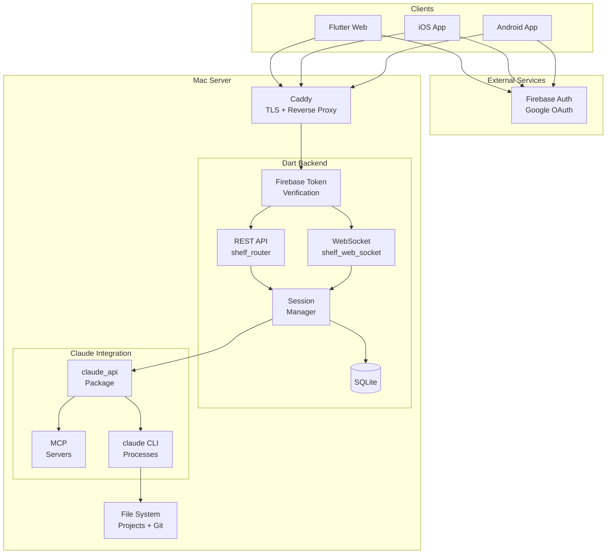
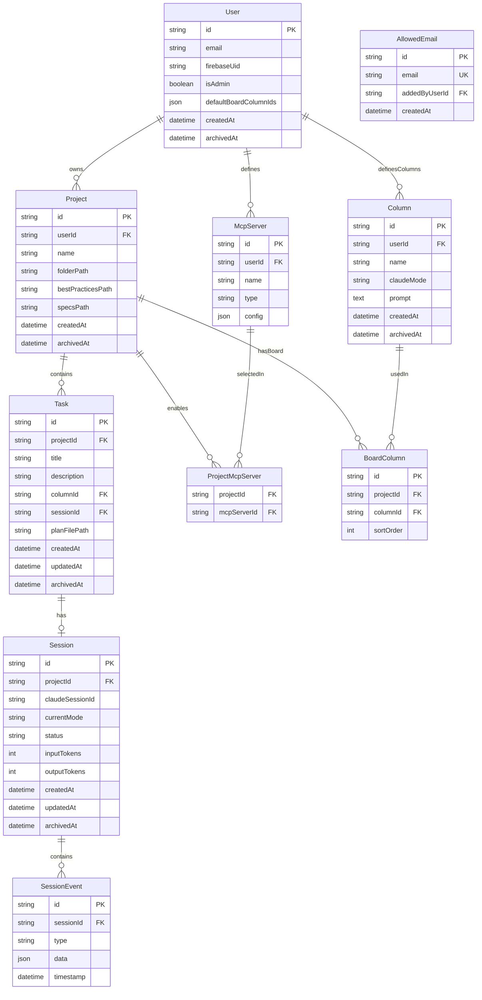
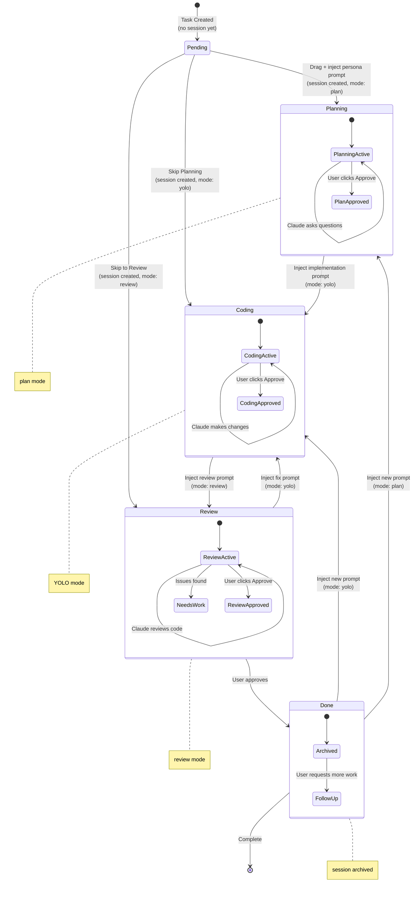

# Requirements & Research: Agent Board

## Goals

Build a **kanban-based agent orchestration platform** that blends a visual
workflow metaphor with Claude Code automation. The system enables users to:

1. **Manage coding tasks visually** — Cards flow through columns (Pending →
   Planning → Coding → Review → Done), with each column triggering specific
   Claude Code behaviors.

2. **Automate phase transitions** — Dropping a card into a column auto-starts
   Claude work; approving a plan auto-advances the card to the next phase.

3. **Full Claude Code exposure** — Expose the complete `claude_api`
   functionality via a hardened, authenticated backend accessible from anywhere.

4. **Multi-user, multi-project** — Support multiple authenticated users, each
   with isolated projects (local folders), tasks, and session histories.

5. **Cross-platform access** — Flutter Web app (primary) plus native iOS/Android
   apps, all connecting to the same backend.

---

### The Big Picture

Agent Board transforms AI-assisted coding from a conversational tool into a
workflow system. Every feature serves this vision:

- **Visual metaphor** — Kanban boards match how developers think about work
- **Persistent context** — One session per task means Claude remembers
  everything
- **Automatic mode switching** — Each phase optimizes Claude's behavior
- **Approvals as checkpoints** — Humans stay in control of progression
- **Multi-project, multi-device** — Work follows you everywhere

This isn't just a chat wrapper. It's a new way to collaborate with AI on
software development—where the AI understands not just your code, but your
workflow.

---

## User Journeys & Feature Narratives

*The following section describes Agent Board's features as if announcing them to
users. It covers complete user journeys, edge cases, and the reasoning behind
design decisions.*

### The Vision: Your Coding Workflow, Visualized

Agent Board reimagines how developers interact with AI coding assistants.
Instead of a single chat window where tasks blur together, you see your work
laid out as cards on a kanban board—each card representing a discrete task with
its own AI session, moving through phases from idea to completion.

When you drag a card from "Pending" to "Planning," Claude Code springs into
action. When you approve a plan, the card glides to "Coding" and Claude starts
implementing. The visual metaphor matches how developers already think about
work, but now the AI is woven into the workflow itself.

---

### Journey 1: Sarah's First Day with Agent Board

**Sarah is a freelance developer managing three client projects. She's heard
about Agent Board and wants to try it out.**

#### Getting Started

Sarah navigates to Agent Board in her browser. She sees a clean login screen
with a single button: **"Sign in with Google."** She clicks it, authenticates
with her Google account, and... sees an error.

*"Your email is not on the allowlist. Contact your administrator."*

This is intentional. Agent Board isn't open to everyone—it's a controlled
environment. Sarah texts her friend Chris (the admin) who adds
`sarah@freelance.dev` to the allowlist through the admin panel. Sarah refreshes,
signs in again, and this time she's in.

**Edge Case: What if Sarah's email gets removed from the allowlist while she's
logged in?** Her next API request returns a 401. The frontend detects this and
shows a friendly message: "Your session has ended. Please sign in again." When
she tries, she sees the allowlist error. No data is lost—her projects and tasks
are preserved, just inaccessible until re-approved.

#### Creating Her First Project

Sarah sees an empty board with a welcoming message: "Create your first project
to get started."

She clicks **"New Project"** and a file browser appears. This isn't just a text
input—it's a full folder browser showing the host machine's filesystem. Sarah
navigates through `/Users/sarah/clients/` and sees her client folders listed.
She can browse anywhere on the filesystem.

She clicks on `acme-website` and Agent Board checks this folder... it's not a
git repository.

A dialog appears:

> **Git Repository Required**
>
> This folder is not a git repository. Agent Board tracks your work using git.
>
> [Initialize Git] [Cancel]

Sarah clicks **"Initialize Git"** and Agent Board runs `git init` in the
background. Success.

The project name field auto-fills with **"acme-website"** (the folder name).
Sarah edits it to "Acme Website Redesign" and clicks Create. The project appears
on her board with five default columns: Pending, Planning, Coding, Review, and
Done.

The project header shows: **Acme Website Redesign** `main`

That `main` is the current git branch. Sarah notices it would show `main*` if
she had uncommitted changes—a subtle but useful indicator.

**Edge Case: What if git isn't installed on the system?** When Sarah tries to
create a project, Agent Board runs a quick check. If `git` isn't found in PATH,
she sees: "Git is required but not installed. Please install git and try again."
The project creation is blocked entirely—no way to proceed without git.

#### Creating a New Folder

Sarah's next client doesn't have a project folder yet. Instead of leaving Agent
Board to create one manually, she clicks **"New Project"** again and navigates
to `/Users/sarah/clients/`. She clicks the **"New Folder"** button in the
browser, names it `newclient-app`, and selects it. Agent Board automatically
runs `git init` (since it's empty), and Sarah has a fresh project ready to go.

The project name defaults to **"newclient-app"**—she can rename it later if
needed.

**Edge Case: What if Sarah tries to create a folder in a location without write
permissions?** The server-side folder creation fails and Sarah sees: "Cannot
create folder. Check permissions." The browser stays open so she can choose a
different location.

---

### Journey 2: Marcus Tackles a Feature Request

**Marcus is a backend developer working on an e-commerce platform. He has a
feature request: "Add a wishlist feature to the product pages."**

#### Creating the Task

Marcus opens his "E-Commerce Platform" project in Agent Board. He clicks the
**"+"** button in the Pending column and creates a new task:

- **Title:** Add Wishlist Feature
- **Description:** Users should be able to add products to a wishlist from the
  product detail page. The wishlist should persist across sessions and be
  accessible from the user's account page.

The card appears in Pending. No Claude session exists yet—Agent Board uses
**lazy session creation** to conserve resources. The session will be created
when Marcus first interacts with Claude.

#### Into Planning

Marcus drags the card to **Planning**. Several things happen instantly:

1. A Claude Code session is created for this task
2. Claude is put into **plan mode** (no automatic code execution)
3. A persona prompt is injected: *"You are a senior software architect. Analyze
   the codebase and create a detailed implementation plan for the following
   feature..."*
4. The task description is sent as the first message

The chat panel on the right activates, showing Claude's thinking. Claude begins
exploring the codebase, finding the existing product models, user authentication
system, and database schema.

Marcus watches Claude work. After a minute, Claude asks a question:

> **Database Choice**
>
> Should the wishlist be stored in the existing PostgreSQL database or would you
> prefer a separate Redis cache for faster access?
>
> ┌─────────────────┐  ┌─────────────────┐ │ PostgreSQL      │  │ Redis Cache │
> │ (Recommended)   │  │                 │ │ Consistent with │  │ Faster reads,
> │ │ existing data   │  │ eventual        │ │ model           │  │ consistency
> │ └─────────────────┘  └─────────────────┘
>
> ┌─────────────────┐ │ Other...        │ └─────────────────┘

This is the **AskUserQuestion** feature in action. Claude needs Marcus's input
to proceed. Marcus taps "PostgreSQL" and the answer flows back to Claude, who
continues planning.

**Edge Case: What if Marcus doesn't answer for hours?** The session remains open
indefinitely. Claude is paused, waiting for input. When Marcus returns (even
from a different device), he sees the same question waiting. No timeout, no lost
context.

**Edge Case: What if Marcus selects "Other..."?** A text input appears. Marcus
can type a custom response like "Use PostgreSQL but add a Redis cache layer for
frequently accessed wishlists." This free-form answer is sent to Claude.

#### The Plan Emerges

After 10 minutes of back-and-forth, Claude presents a comprehensive plan:

```
## Implementation Plan: Wishlist Feature

### Phase 1: Database Schema
- Add `wishlists` table with user_id, product_id, created_at
- Add foreign key constraints to users and products tables

### Phase 2: Backend API
- POST /api/wishlist/{product_id} - Add to wishlist
- DELETE /api/wishlist/{product_id} - Remove from wishlist
- GET /api/wishlist - List user's wishlist

### Phase 3: Frontend Integration
- Add heart icon to product cards
- Create wishlist page in user account section
- Implement optimistic UI updates

### Estimated Files to Modify
- migrations/20241220_add_wishlists.sql (new)
- src/models/wishlist.py (new)
- src/routes/wishlist.py (new)
- src/templates/product_detail.html
- src/templates/account/wishlist.html (new)
- src/static/js/wishlist.js (new)
```

Marcus reviews the plan. It looks good. He clicks the persistent **"Approve"**
button at the bottom of the chat panel.

#### Plan File Output

When Marcus approves, Agent Board saves the plan to a file:

```
✓ Saved plan to specs/add-wishlist-feature-plan.md
```

The filename is auto-generated from the task title ("Add Wishlist Feature" →
`add-wishlist-feature-plan.md`). The `specs/` folder is the default location,
configurable per-project.

Now the plan exists as a permanent artifact. Other developers can review it, it
can be version-controlled with git, and Claude can reference it during
implementation.

The card smoothly animates from Planning to Coding.

---

### Journey 3: The Coding Phase

**Continuing Marcus's wishlist implementation...**

#### Automatic Mode Switch

When the card lands in **Coding**, Agent Board:

1. Switches Claude to **YOLO mode** (auto-accept all file edits)
2. Injects a prompt that references the plan file: *"Implement the plan in
   @specs/add-wishlist-feature-plan.md. Create and modify files as needed.
   Proceed with the implementation."*

Claude immediately starts working. The chat shows a flurry of activity:

```
📄 Creating migrations/20241220_add_wishlists.sql
   ✓ Created table schema with indexes

📄 Creating src/models/wishlist.py
   ✓ Wishlist model with add/remove/list methods

📄 Creating src/routes/wishlist.py
   ✓ API endpoints with authentication checks

📄 Editing src/templates/product_detail.html
   ✓ Added wishlist heart button

...
```

Each tool invocation appears as a collapsible card—exactly like Claude Code's
native terminal UI. Marcus can expand any card to see the full file diff or
command output.

#### The @ File Reference

Notice the `@specs/add-wishlist-feature-plan.md` in the injected prompt? This is
a **file reference**. When Marcus types in the chat, he can use `@` to reference
any file in the project:

Marcus types: `@src/models/` and sees autocomplete options:
```
@src/models/user.py
@src/models/product.py
@src/models/wishlist.py
```

He selects `@src/models/wishlist.py` and continues: "add a priority field to
this model."

The file reference tells Claude exactly which file Marcus is talking about. The
file's contents are included in the context. This is especially powerful when
Marcus wants to reference multiple files in a single message.

Agent Board maintains a **file cache** that's updated in real-time via WebSocket
as the server watches the project folder for changes. Autocomplete is instant,
even for large projects.

**Edge Case: What if Claude makes a mistake mid-implementation?** Marcus can
type a message at any time: "Wait, @src/models/wishlist.py should also store a
'priority' field." Claude acknowledges and adjusts its implementation. The
session is conversational—not a one-way broadcast.

**Edge Case: What if Marcus wants to pause and continue tomorrow?** He simply
closes the browser. The Claude process continues running on the server. When
Marcus returns, he sees exactly where Claude left off. If Claude finished while
he was away, the chat shows the completion message and the Approve button is
waiting.

#### The Approve Button

Unlike Planning (where approval means "the plan is good, start coding"), in
Coding the Approve button means "I'm satisfied with the implementation, move to
review."

Marcus watches Claude finish the last file. He scrolls through the changes,
spots a minor issue, and types: "Can you add input validation to the POST
endpoint?" Claude makes the adjustment.

Now satisfied, Marcus clicks **Approve**. The card moves to Review.

---

### Journey 4: The Review Phase

**The wishlist feature is implemented. Now it needs review.**

#### Automated Verification First

When the card lands in **Review**, Agent Board doesn't just ask Claude to look
at the code—it runs automated checks first. The system:

1. **Runs the test suite** (configured via CLAUDE.md)
2. **Runs static analysis** (linting, type checking, compilation)
3. **Collects all output** for Claude to analyze

Marcus watches as the verification runs:

```
🧪 Running tests...
   ✗ 2 tests failed, 15 passed

🔍 Running static analysis...
   ⚠️ 3 linting warnings
   ✓ Type check passed
   ✓ Build succeeded
```

#### Claude's Prioritized Review

Claude receives the verification results along with a review prompt. It analyzes
everything and produces a **prioritized numbered list**:

```
## Code Review: Wishlist Feature

Based on test results and code analysis, here are the issues to address:

1. [HIGH] test_wishlist_api.py:45 - test_add_duplicate_product fails
   The endpoint returns 200 instead of 409 Conflict when adding a duplicate.

2. [HIGH] test_wishlist_api.py:67 - test_remove_nonexistent fails
   Removing a product not in wishlist returns 500 instead of 404.

3. [MEDIUM] src/routes/wishlist.py:23 - Unused import 'datetime'
   Linter warning: imported but never used.

4. [MEDIUM] src/routes/wishlist.py:45 - Line too long (127 > 120)
   Consider breaking this line for readability.

5. [LOW] src/models/wishlist.py:12 - Missing docstring
   Public method 'add_to_wishlist' should have documentation.

Which items should I fix? Reply with numbers and any comments.
(e.g., "1, 2, 3 - skip 4 and 5 for now")
```

#### Text-Based Selection

Marcus doesn't need to click checkboxes or navigate a complex UI. He simply
types his response in the chat:

**Marcus:** `1, 2, 3 - ignore the docstring warning, we'll add those later`

Claude acknowledges and the card moves back to **Coding** automatically. Claude
now has clear instructions: fix items 1, 2, and 3. It immediately starts
working:

```
📄 Editing src/routes/wishlist.py
   ✓ Added 409 Conflict response for duplicate products
   ✓ Added 404 response for removing non-existent items
   ✓ Removed unused datetime import
   ✓ Fixed line length issue
```

When done, Marcus clicks Approve and the card returns to Review. The
verification runs again—this time all tests pass and no linting warnings remain.
Claude confirms:

```
## Review Complete ✓

All selected issues have been resolved:
- Tests: 17 passed, 0 failed
- Static analysis: No warnings
- The docstring issue was skipped per your request.

Ready to move to Done.
```

Marcus clicks **Approve**, and the card moves to **Done**.

#### Skipping Review Entirely

Not every task needs formal review. For quick fixes or documentation changes,
Marcus can drag the card directly from **Coding** to **Done**, bypassing Review
completely.

**Edge Case: What if the Review → Coding loop goes on forever?** There's no
automatic limit. The loop continues until Marcus is satisfied. In practice,
after 2-3 iterations, most issues are resolved. If Claude seems stuck, Marcus
can type explicit instructions or drag directly to Done.

**Edge Case: What if tests or linting aren't configured?** Review still works—
Claude performs a code-only review without automated verification. The system
prompts Marcus to configure CLAUDE.md via `/init` for better review coverage.

---

### Journey 5: The Done Column & Follow-Up Work

**The wishlist feature is complete. But Marcus has one more request...**

#### Optional Follow-Up

In the Done column, there's no automatic Claude action. The session is archived
but remains accessible. Marcus sees a subtle indicator showing the session is
available for follow-up.

He clicks on the task card and types: "Can you generate API documentation for
the wishlist endpoints?"

Claude (same session, full context preserved) generates OpenAPI/Swagger
documentation. Marcus copies it into his docs folder. The task stays in Done.

**Edge Case: What if Marcus wants to add more features to this task?** He can
drag the card back to Planning or Coding. The same session continues—Claude
remembers everything about the wishlist implementation. A prompt is injected
based on which column Marcus chose.

**Edge Case: Can Marcus ever "truly" complete a task?** The card can stay in
Done indefinitely. There's no archive action in V1. The soft-delete pattern
means nothing is ever truly deleted—just filtered from view when archive
functionality is added later.

---

### Journey 6: Multi-Project, Multi-Task Reality

**Sarah (from Journey 1) is now juggling three projects with multiple tasks
each.**

#### The Project Selector

Sarah's board shows one project at a time. In the header, she sees a dropdown:
**Acme Website Redesign ▼**. Clicking it reveals:

- Acme Website Redesign `main`
- Client B Mobile App `feature/auth*`
- Personal Portfolio `main`
- newclient-app `main`

The asterisk on `feature/auth*` indicates uncommitted changes in that project's
git repository.

Sarah switches to "Client B Mobile App" and sees a completely different board
with its own tasks, columns, and configurations.

#### Concurrent Sessions

Sarah has tasks in Coding phase on two different projects. Both Claude sessions
are running simultaneously on the server. She switches between projects, and the
chat panel updates to show the relevant session.

**Edge Case: What if Sarah runs 20 concurrent tasks?** There's no enforced
limit. The backend spawns a Claude CLI process per active session. On a Mac with
16GB RAM, practical limits emerge around 5-10 concurrent sessions depending on
task complexity. Resource management is Sarah's responsibility.

**Edge Case: What about usage costs?** Users may be on Claude Max (subscription)
or pay-per-use. Token usage is tracked per-session (visible in the data model)
but V1 doesn't expose cost dashboards. Heavy users can monitor usage through
their Anthropic account if applicable.

---

### Journey 7: The Admin Experience

**Chris is the administrator who set up Agent Board for his team.**

#### Initial Setup

Chris deployed Agent Board on his Mac Mini, configured Caddy for HTTPS, and set
the environment variable:

```bash
ADMIN_EMAIL=chris@team.dev
```

When Chris signs in with Google (using `chris@team.dev`), he automatically gets
admin privileges. No separate admin account creation needed.

#### Managing the Allowlist

In User Settings, Chris sees tabs that regular users don't:

- **Profile** (everyone has this)
- **Allowlist** (admin only)
- **All Users** (admin only)

The Allowlist tab shows email addresses that can access the system:

```
┌─────────────────────────────────────────┐
│ Allowed Emails                          │
├─────────────────────────────────────────┤
│ sarah@freelance.dev     Added Dec 20    │
│ marcus@team.dev         Added Dec 18    │
│ new-hire@team.dev       Added Dec 19    │
│                                         │
│ [+ Add Email]                           │
└─────────────────────────────────────────┘
```

Chris can add new emails or remove existing ones. The admin email
(`chris@team.dev`) doesn't appear here—it's implicitly always allowed.

**Edge Case: Can Chris remove himself from admin?** The `ADMIN_EMAIL`
environment variable is the source of truth. Chris can't un-admin himself
through the UI. To change admin, he'd modify the environment variable and
restart the server.

#### Viewing All Users

The "All Users" tab shows everyone who has ever signed in:

```
┌────────────────────────────────────────────────────┐
│ All Users                                          │
├────────────────────────────────────────────────────┤
│ chris@team.dev        Admin    3 projects  Active  │
│ sarah@freelance.dev   User     2 projects  Active  │
│ marcus@team.dev       User     1 project   Active  │
│ old-contractor@x.com  User     1 project   Archived│
└────────────────────────────────────────────────────┘
```

Chris can click on any user to see their projects, tasks, and sessions. Full
visibility—useful for debugging issues or understanding system usage.

**Edge Case: What if Chris needs to remove a user completely?** Soft delete
only. Chris can archive a user, which filters them from active views. Their data
remains in the database. True deletion is out of scope for V1.

---

### Journey 8: Mobile Experience

**Marcus is on the train, checking on his wishlist task from his phone.**

#### Responsive Design

Agent Board's Flutter Web app adapts to mobile screens:

- The kanban board becomes horizontally scrollable
- Column headers stay visible while scrolling
- Cards show truncated titles with tap-to-expand
- The chat panel becomes a slide-up sheet

Marcus opens the app, authenticates via Google (mobile OAuth flow), and sees his
projects. He taps "E-Commerce Platform" and scrolls to find the wishlist task in
the Review column.

He taps the card. The chat panel slides up, showing Claude's latest review.
Marcus can read the conversation, scroll through history, and even send
messages.

**Edge Case: What about the AskUserQuestion UI on mobile?** The chip/tab
selector adapts to mobile constraints. Options stack vertically if needed. The
"Other..." option opens the mobile keyboard for text input.

**Edge Case: What if Marcus loses network mid-session?** The app shows a
"Reconnecting..." indicator. Pending messages are queued. When connectivity
returns, messages sync automatically. If offline for extended periods, the app
shows cached data (read-only) until reconnection.

---

### Journey 9: Skipping Columns & Non-Linear Workflows

**Not every task needs full ceremony.**

#### Direct to Coding

Lisa has a simple bug fix: "Fix typo in homepage banner." She creates the task
in Pending and drags it directly to **Coding**, skipping Planning entirely.

Claude's session is created in YOLO mode immediately. The task description
becomes the first prompt. No planning phase needed.

**Edge Case: What prompt is injected if Planning is skipped?** Each column has a
configurable prompt template. Coding's default includes: "You are implementing
the following task. Proceed with the implementation." If coming from Planning,
an additional "Implement the plan above" is prepended. Column configuration
allows customizing this behavior.

#### Direct to Done

For tasks that don't need AI at all (like "Update DNS records"), Lisa can drag
directly to Done. No session is created. The task is simply a visual tracker.

**Edge Case: Can Lisa later drag it back and start a session?** Yes. Dragging
from Done to any working column (Planning, Coding, Review) creates a session if
one doesn't exist and injects the appropriate prompt.

---

### Journey 10: Custom Columns & Boards

**Marcus wants to customize his workflow with a "Testing" phase.**

#### User-Global Column Definitions

Marcus opens **User Settings → Column Library**. He sees his column definitions:

```
┌─────────────────────────────────────────────────────────────────┐
│ My Column Library                                               │
├─────────────────────────────────────────────────────────────────┤
│ Pending     | No mode      | (no prompt)                        │
│ Planning    | plan         | "You are a senior architect..."    │
│ Coding      | yolo         | "Implement the following..."       │
│ Review      | review       | "Review the implementation..."     │
│ Done        | No mode      | (no prompt)                        │
│                                                                 │
│ [+ Add Column]                                                  │
└─────────────────────────────────────────────────────────────────┘
```

These columns are **user-global**—they belong to Marcus, not to any specific
project. He clicks **"+ Add Column"** and creates:

```
Name: Testing
Mode: yolo
Prompt: "Write comprehensive tests for the implementation above. Include unit tests, integration tests, and edge case coverage."
```

The new column appears in his library. Now Marcus can use it in any project.

#### Per-Project Board Configuration

Marcus opens his "E-Commerce Platform" project and navigates to **Project
Settings → Board**. He sees the current board arrangement:

```
Current Board: Pending → Planning → Coding → Review → Done

Available columns from your library:
  □ Testing (not in board)
```

He drags **Testing** into position between Coding and Review:

```
Board: Pending → Planning → Coding → Testing → Review → Done
```

The board updates immediately. Now this project has a Testing phase, but other
projects keep their original layout.

#### Default Board Configuration

In **User Settings → Defaults**, Marcus can configure which columns appear in
new projects by default:

```
Default Board for New Projects:
  ☑ Pending
  ☑ Planning
  ☑ Coding
  ☑ Testing  ← (Marcus added this)
  ☑ Review
  ☑ Done
```

Now when Marcus creates a new project, it automatically includes the Testing
column.

**Edge Case: What happens to existing tasks when columns change?** Tasks
reference columns by ID. If Marcus removes a column from a project's board,
tasks in that column remain—they just appear in a "limbo" state until moved.

**Edge Case: Can columns be deleted from the library?** In V1, columns can be
archived. Archived columns are hidden from the library but persist for any
projects still using them. True deletion is deferred to future versions.

**Edge Case: Can Marcus share columns with teammates?** In V1, columns are
strictly per-user. Each user maintains their own column library. Sharing column
definitions is a future feature.

---

### Journey 11: The Four-Tab Interface

**Sarah wants to understand the project structure while working on a task.**

#### The Tab Layout

Agent Board's interface has four main tabs:

1. **Kanban Board** — The main view showing columns and task cards
2. **Chat** — The Claude conversation for the selected task
3. **Files** — A file browser showing the project's file tree
4. **Changes** — Git diff view showing uncommitted changes

Sarah clicks on the **Files** tab. The file browser shows the current branch's
file tree in a collapsible hierarchy:

```
📁 acme-website/
├── 📁 src/
│   ├── 📁 components/
│   │   ├── Header.tsx
│   │   ├── Footer.tsx
│   │   └── Wishlist.tsx ← (new)
│   ├── 📁 pages/
│   │   └── ProductDetail.tsx
│   └── App.tsx
├── 📁 tests/
│   └── wishlist.test.ts ← (new)
├── package.json
└── README.md
```

She clicks on `Wishlist.tsx` and the file contents appear in a
syntax-highlighted viewer. She can see exactly what Claude implemented without
leaving Agent Board.

#### The Changes Tab

Sarah clicks the **Changes** tab to see what's been modified. This shows the git
diff for the current branch:

```
Modified files:
  M src/pages/ProductDetail.tsx
  A src/components/Wishlist.tsx
  A tests/wishlist.test.ts
```

She expands `ProductDetail.tsx` to see the diff:

```diff
@@ -15,6 +15,7 @@ export function ProductDetail({ product }) {
   return (
     <div className="product-detail">
       <h1>{product.name}</h1>
+      <WishlistButton productId={product.id} />
       <p>{product.description}</p>
     </div>
   );
```

The Changes tab reflects the current git state for the project's branch. As
Claude makes changes, the diff updates in real-time.

**Edge Case: What if Sarah switches projects?** The Files and Changes tabs show
data for the currently selected project. Switching projects updates both tabs to
reflect the new project's files and git state.

**Edge Case: What branch does the Files tab show?** The current branch for the
project. If Sarah switches branches via terminal, the Files tab reflects the new
branch after a refresh.

---

### Journey 12: Setting Up CLAUDE.md with /init

**Marcus wants to configure test commands for his project's Review phase.**

#### The /init Command

Marcus opens the **Chat** tab (without a task selected) and types `/`. A popup
appears showing available slash commands:

```
┌─────────────────────────────────┐
│ Slash Commands                  │
├─────────────────────────────────┤
│ /init  - Configure project      │
│ /help  - Show help              │
└─────────────────────────────────┘
```

He selects `/init`. Claude responds:

```
## Project Configuration

I'll help you set up your project's CLAUDE.md file. This configures how Agent
Board runs tests and static analysis during Review.

Let me check your project structure...

I found:
- package.json (Node.js project)
- Jest configuration present
- ESLint configuration present

Recommended CLAUDE.md settings:

```markdown
# Test Commands
test_command: npm test
lint_command: npm run lint
build_command: npm run build
```

Should I create this file, or would you like to customize it?
```

Marcus types: "Also add TypeScript type checking"

Claude updates the recommendation and creates the file:

```
✓ Created CLAUDE.md in project root

Contents:
# Test Commands
test_command: npm test lint_command: npm run lint build_command: npm run build
typecheck_command: npx tsc --noEmit
```

Now when tasks enter Review, Agent Board runs all four commands and feeds the
results to Claude.

#### Editing CLAUDE.md Later

The CLAUDE.md file is just a regular file in the project. Marcus can:
- Edit it directly in his IDE
- Use `/init` again to regenerate or update
- View it in the Files tab

**Edge Case: What if CLAUDE.md doesn't exist when entering Review?** Review
still works—Claude performs a code-only review. The system notes: "Tip: Run
/init to configure automated testing for better reviews."

**Edge Case: What if a test command fails to run (not found)?** The error is
captured and shown to Claude: "Command 'npm test' failed: npm not found." Claude
can advise Marcus on fixing the configuration.

---

### Edge Case Compendium

A collection of additional edge cases and their resolutions:

#### Authentication & Access

| Edge Case                               | Behavior                                                                             |
| --------------------------------------- | ------------------------------------------------------------------------------------ |
| User signs in with wrong Google account | Can sign out and retry; no way to "switch" accounts in-session                       |
| Firebase is down                        | Login fails; existing sessions continue (tokens already verified) until next request |
| User's Google account is deleted        | Next login attempt fails; data preserved but inaccessible                            |

#### Git & File System

| Edge Case                                          | Behavior                                                                |
| -------------------------------------------------- | ----------------------------------------------------------------------- |
| User deletes project folder while tasks are active | Claude errors on file operations; user must fix path or archive project |
| Git branch is deleted remotely                     | Local branch still shows; user must handle git state manually           |
| Folder permissions change                          | Claude's file operations fail; visible in session log                   |
| Symlinks in project path                           | Resolved to real path; works normally                                   |

#### Claude Sessions

| Edge Case                      | Behavior                                                                   |
| ------------------------------ | -------------------------------------------------------------------------- |
| Claude CLI crashes mid-task    | Session shows error state; user can retry or start new message             |
| Anthropic API rate limit hit   | Claude returns rate limit error; displayed in chat; user waits and retries |
| Session context exceeds limit  | Auto-compact (configured on session) compresses history automatically      |
| Claude hallucinates file paths | File operations fail; errors shown in chat; user corrects Claude           |

#### Data & Storage

| Edge Case                               | Behavior                                                     |
| --------------------------------------- | ------------------------------------------------------------ |
| SQLite database corrupted               | Backend fails to start; restore from backup (future feature) |
| Disk full                               | Write operations fail; logged; user must free space          |
| Task created during network issues      | Frontend queues creation; syncs when reconnected             |
| Two users edit same task simultaneously | Last-write-wins; no real-time collaboration locks in V1      |

#### UI & Interaction

| Edge Case                                 | Behavior                                           |
| ----------------------------------------- | -------------------------------------------------- |
| User drags card but drops outside columns | Card returns to original column                    |
| User rapidly switches between tasks       | Chat panel updates; old sessions remain active     |
| Browser tab closed during active session  | Session continues server-side; resumes on reopen   |
| User clears browser data                  | Must re-login; session state preserved server-side |

---

## Features

### Backend Features

| Feature                        | Description                                                                                                                                   | Priority |
| ------------------------------ | --------------------------------------------------------------------------------------------------------------------------------------------- | -------- |
| **Firebase Google OAuth**      | Google sign-in via Firebase Authentication. Backend verifies Firebase ID tokens.                                                              | P0       |
| **Email Allowlist**            | Admin pre-approves email addresses. Unapproved emails rejected at login.                                                                      | P0       |
| **Admin Access**               | `ADMIN_EMAIL` env var grants full system access (all users, all projects, allowlist management).                                              | P0       |
| **User Management**            | Multi-user with full isolation. Admin can view/manage all users and their data.                                                               | P0       |
| **Remote Folder Browser**      | Browse host filesystem from anywhere. Create new folders. Select existing folder for project. No path typing needed.                          | P0       |
| **Project Management**         | CRUD for projects. Folder selected via browser. Name defaults to folder name. **Requires git repo** (prompt for `git init` if missing).       | P0       |
| **Branch Display**             | Show current branch + dirty state (e.g., `main*`) wherever project name appears.                                                              | P0       |
| **Filesystem Watching**        | Server watches project folders for file changes. Pushes deltas to UI via WebSocket for instant file cache updates.                            | P0       |
| **Task Management**            | CRUD for tasks. Each task = title + description + column + linked session.                                                                    | P0       |
| **Session Management**         | Create, resume, duplicate, delete sessions. Streaming via WebSocket.                                                                          | P0       |
| **Plan File Output**           | Planning column saves plan to file in `specs/` folder (configurable). Filename is task-specific (e.g., `wishlist-feature-plan.md`).           | P0       |
| **@ File References**          | Coding column references plan via `@specs/task-name-plan.md`. Autocomplete shows matching files from cached file list.                        | P0       |
| **Column Transition Prompts**  | Inject persona/instruction prompts when card moves columns (same session continues).                                                          | P0       |
| **Mode Switching**             | Change Claude mode settings (plan mode, YOLO mode, etc.) on column transitions.                                                               | P0       |
| **Review with Verification**   | Review column runs tests + static analysis (lint/compile). Creates prioritized feedback. User selects items to fix via checkboxes + comments. | P0       |
| **Interactive Tool Responses** | Intercept `AskUserQuestion` tool calls, relay to frontend, inject user responses.                                                             | P0       |
| **Column Definitions**         | User-global column definitions with name, mode, and prompt. Columns can be archived.                                                          | P0       |
| **Board Configuration**        | Per-project boards built from user's column definitions. Default board configurable. Columns can be added/removed/reordered per project.      | P0       |
| **MCP Server Registry**        | **Per-user** MCP server definitions. Per-project selection of which servers to enable.                                                        | P1       |
| **Best Practices Files**       | Per-project markdown file path for Review phase prompting.                                                                                    | P1       |
| **Rate Limiting**              | Protect backend from abuse. Per-user limits.                                                                                                  | P1       |
| **SQLite Persistence**         | All data persisted. Sessions/history retained forever.                                                                                        | P0       |

### Frontend Features

| Feature                     | Description                                                                                                                | Priority |
| --------------------------- | -------------------------------------------------------------------------------------------------------------------------- | -------- |
| **Four-Tab Interface**      | Main layout with tabs: **Kanban Board**, **Chat**, **Files**, **Changes**. Tabs persist across project/task selection.     | P0       |
| **Kanban Board Tab**        | `appflowy_board` with drag-and-drop columns. Cards show title + status. Current branch displayed.                          | P0       |
| **Chat Tab**                | `flutter_ai_toolkit` with custom provider wrapping `claude_api`. Shows selected task's session. Slash command support.     | P0       |
| **Files Tab**               | File browser showing project's file tree for current branch. Click to view file contents with syntax highlighting.         | P0       |
| **Changes Tab**             | Git diff view showing uncommitted changes per branch. Expand files to see inline diffs.                                    | P0       |
| **@ File References**       | Type `@` in chat to trigger autocomplete. Shows project files from cached file list. Multiple files supported per message. | P0       |
| **Slash Command UI**        | Type `/` in chat to see available commands. Popup shows options like `/init`, `/help`. Commands expand to full prompts.    | P0       |
| **Tool Invocation Display** | **Match Claude Code's exact tool visualization** — collapsible cards for Read, Edit, Bash, etc.                            | P0       |
| **Phase Approval Button**   | Persistent "Approve" button in chat UI to advance card to next column.                                                     | P0       |
| **Interactive Q&A Widget**  | Chip/tab selector UI for `AskUserQuestion`. Supports single/multi-select + custom input.                                   | P0       |
| **Project Selector**        | Dropdown/drawer to switch between projects.                                                                                | P0       |
| **Task Detail View**        | View/edit task title, description, current column, linked session.                                                         | P0       |
| **Folder Browser Dialog**   | Full filesystem browser for project creation. Navigate anywhere, create new folders, select existing.                      | P0       |
| **Session History**         | List of past sessions. View, duplicate, or continue.                                                                       | P1       |
| **Column Config UI**        | Configure user-global column definitions (name, mode, prompt). Columns can be reused across projects.                      | P1       |
| **Board Config UI**         | Per-project board configuration. Add/remove/reorder columns from user's column library. Set default board.                 | P1       |
| **MCP Server Config UI**    | View global servers, toggle per-project enablement.                                                                        | P2       |
| **User Settings**           | Profile view, sign out. Admin: allowlist management, view all users.                                                       | P1       |

### Cross-Cutting Features

| Feature                          | Description                                                 | Priority |
| -------------------------------- | ----------------------------------------------------------- | -------- |
| **Real-Time Streaming**          | WebSocket for session events. Immediate UI updates.         | P0       |
| **Offline Graceful Degradation** | Show cached data when offline. Queue actions for reconnect. | P2       |
| **Responsive Design**            | Works on phone, tablet, desktop browser.                    | P0       |

---

## Known UX / Technical / QA Considerations

### UX Considerations

1. **Auto-Start Feedback** — When a card is dropped and work auto-starts,
   provide clear visual feedback (spinner, status badge) so user knows Claude is
   working.

2. **Phase Approval Flow** — ✅ **DECIDED:** Explicit "Approve" button in chat UI
   (always visible). No text parsing. Button triggers auto-advance to next
   column.

3. **Session Context Switching** — When user selects a different task, the chat
   panel must smoothly switch to that task's session without losing scroll
   position in the board.

4. **Long-Running Sessions** — Claude work can take minutes. Show progress
   indicators, allow user to navigate away and return.

5. **Error Recovery** — If Claude errors mid-task, card should NOT auto-advance.
   Show error state, allow retry or manual intervention.

### Technical Considerations

1. **Process Per Session** — The `claude_api` spawns a new `claude` CLI process
   per message. For concurrent tasks, this means multiple processes. Monitor
   resource usage.

2. **Session ID Management** — `claude_api` uses session IDs for resumption. The
   backend must map Task → Session → claude_api session ID correctly.

3. **WebSocket Scaling** — Each active session needs a WebSocket. With multiple
   users and tasks, connection count grows. Consider connection pooling or
   limits.

4. **File System Access** — Backend runs on local Mac, so file paths in projects
   are local. For remote access, paths are still local to the Mac running the
   backend.

5. **Git Operations** — If git-aware, need to handle repos with large histories,
   submodules, or unusual configs gracefully.

6. **MCP Server Lifecycle** — MCP servers (from `claude_api`) use auto-allocated
   ports. Must ensure proper cleanup on session end.

7. **Firebase Token Verification** — Backend verifies Firebase ID tokens on each
   request. If token expired, frontend detects 401 and prompts re-login.

8. **SQLite Concurrency** — SQLite handles concurrent reads well but
   single-writer. For multi-user, use WAL mode and handle busy states.

9. **AskUserQuestion Interception** — The `claude_api` package currently closes
   stdin immediately after sending a message (fire-and-forget model). To support
   interactive tool responses, we need bidirectional communication. See
   "AskUserQuestion Integration" in Tech Notes for details.

### QA Considerations

1. **Integration Tests** — Test full flow: create task → drag to Planning →
   Claude responds → approve → auto-advance → Coding → etc.

2. **Session Resumption** — Verify sessions resume correctly after backend
   restart, after client disconnect, after app backgrounding.

3. **Concurrent Sessions** — Test multiple active sessions simultaneously
   (different tasks, same user).

4. **Authentication Edge Cases** — Expired tokens, invalid tokens, token refresh
   race conditions.

5. **WebSocket Reconnection** — Test client reconnect after network drop, server
   restart.

6. **Error Scenarios** — Claude process crash, MCP server failure, disk full,
   invalid project path.

---

## Tech Notes from Research

### claude_api Package (from /Users/csells/code/Norbert515/vide_cli/packages/claude_api)

**Architecture:**
- `ClaudeClient` is the main entry point, created with
  `ClaudeClient.create(config, mcpServers)`
- Spawns `claude` CLI process per message with `--output-format=stream-json`
- Session continuity via `--session-id` (first message) and `--resume`
  (subsequent)
- Streams JSONL responses parsed into typed `ClaudeResponse` subclasses

**Key Classes:**
- `ClaudeClient` — Send messages, get conversation stream, abort, access MCP
  servers
- `ClaudeConfig` — Model, timeout, temperature, system prompt, working
  directory, permission mode
- `Conversation` — Messages, state, token counts
- `ConversationMessage` — Role, content, tool invocations, streaming state
- `McpServerBase` — Abstract base for MCP servers with auto port allocation

**Response Types:**
- `TextResponse` — Streaming text (partial/complete)
- `ToolUseResponse` — Tool invocation with parameters
- `ToolResultResponse` — Tool output
- `CompletionResponse` — Turn complete with token usage
- `ErrorResponse` — Error with details

**Session Persistence:**
- Claude Code stores history in
  `~/.claude/projects/{encoded-path}/{sessionId}.jsonl`
- `ConversationLoader` reads history, merges tool results, decodes HTML entities

**Key Insight:** The package is process-per-message, not connection-based. Each
`sendMessage()` spawns a new CLI process. Session state maintained by Claude
Code's own persistence, not in-memory.

### AskUserQuestion Integration (CRITICAL FEATURE)

**How AskUserQuestion Works in Claude Code CLI:**

When Claude needs user input, it invokes the `AskUserQuestion` tool. In the CLI:
1. Claude emits a `tool_use` event with `name: "AskUserQuestion"`
2. The CLI's native terminal UI displays the chip/tab selector
3. User selects an option
4. CLI sends the answer as a `tool_result` back to Claude
5. Claude continues processing

**AskUserQuestion Tool Schema:**
```json
{
  "questions": [
    {
      "question": "Full question text (required)",
      "header": "Short label, max 12 chars (required)",
      "multiSelect": false,
      "options": [
        {
          "label": "1-5 word choice (required)",
          "description": "Explanation of this choice (required)"
        }
      ]
    }
  ]
}
```

**Constraints:**
- 1-4 questions per tool call
- 2-4 options per question
- Header max 12 characters
- "Other" option auto-added for custom input
- Multi-select mode available

**Response Format:**
```json
{
  "answers": {
    "question text": "selected option label or custom text"
  }
}
```

**The Gap in claude_api:**

The current `claude_api` package does NOT support AskUserQuestion interception
because:
1. **Stdin closed immediately** — After sending the message JSON, stdin is
   closed (line 237 in `claude_client.dart`)
2. **No tool response injection** — No mechanism to send `tool_result` events
   back to the running process
3. **No tool interception callback** — `ToolUseResponse` events are logged but
   not surfaced for external handling

**Proposed Extension to claude_api:**

To support interactive tools, we need to extend `claude_api` with:

```
// Pseudocode for extended ClaudeClient API

class ClaudeClient {
  // Existing
  Stream<Conversation> get conversation;
  void sendMessage(Message message);

  // NEW: Stream of tool calls that require external handling
  Stream<InteractiveToolRequest> get interactiveToolRequests;

  // NEW: Send a response to an interactive tool
  void respondToTool(String toolUseId, Map<String, dynamic> response);
}

class InteractiveToolRequest {
  String toolUseId;          // For correlation
  String toolName;           // "AskUserQuestion", etc.
  Map<String, dynamic> input; // Tool parameters
}
```

**Implementation Approach Options:**

| Approach                    | Description                                                                                 | Pros                                               | Cons                                                  |
| --------------------------- | ------------------------------------------------------------------------------------------- | -------------------------------------------------- | ----------------------------------------------------- |
| **A. Long-Running Process** | Keep stdin open, send `tool_result` via stdin when user responds                            | Native protocol, no external dependencies          | Requires significant refactor of process management   |
| **B. Custom MCP Server**    | Create an MCP server for user input. Claude calls it, server signals frontend via WebSocket | Works with current process model, clean separation | Bypasses native `AskUserQuestion`, different protocol |
| **C. CLI Hook System**      | Use Claude Code's `pre-tool-use` hooks to intercept and redirect                            | Leverages existing CLI features                    | Hook reliability issues reported, complex setup       |

**✅ DECIDED: Approach A (Long-Running Process)**

**Strategy:** Fork `claude_api` → Extend → Contribute PR back to Norbert

Rationale:
- Uses the native `AskUserQuestion` tool and streaming JSON protocol
- No custom tooling or MCP workarounds
- Full fidelity with Claude Code's intended behavior
- Single source of truth for tool handling
- Contributing upstream benefits the broader community

**Fork & PR Workflow:**
1. Fork `Norbert515/vide_cli` repository
2. Create feature branch `feature/interactive-tool-support`
3. Implement changes to `packages/claude_api`
4. Add tests for new functionality
5. Submit PR to upstream with clear description
6. Use fork as dependency until PR is merged

**Required Changes to claude_api:**

1. **Keep stdin open** during message processing
2. **Detect interactive tool calls** — When `ToolUseResponse.toolName ==
   "AskUserQuestion"`, pause and emit to external stream
3. **Provide response injection** — Accept `tool_result` JSON and write to stdin
4. **Handle timeout/abort** — If user doesn't respond, allow session abort

**Streaming JSON Protocol for Tool Response:**

To respond to a tool call, send this to stdin:
```json
{"type": "tool_result", "tool_use_id": "toolu_xxx", "content": "{\"answers\": {...}}"}
```

The process will then continue with the next response.

### appflowy_board Package (v0.1.2)

**Core Model:**
- `AppFlowyBoardController` — Manages groups (columns) and items (cards)
- `AppFlowyGroupData` — A column with ID, name, and list of items
- `AppFlowyGroupItem` — Interface for card data

**Drag-Drop Callbacks:**
- `onMoveGroup` — Column reordered
- `onMoveGroupItem` — Card moved within column
- `onMoveGroupItemToGroup` — Card moved to different column (key for phase
  transitions)

**Customization:**
- `AppFlowyBoardHeaderBuilder` — Custom column headers
- `AppFlowyBoardFooterBuilder` — Custom column footers
- `AppFlowyBoardCardBuilder` — Custom card widgets

**Platform Support:** Android, iOS, Linux, macOS, Windows, Web

### flutter_ai_toolkit Package

**Core Concept:** `LlmProvider` abstract interface for chat backends

**Key Widget:** `LlmChatView` — Full chat UI with streaming, attachments, voice
input

**Custom Provider Pattern:**
```
abstract class LlmProvider {
  Stream<String> sendMessageStream(String prompt, {List<Attachment>?});
  // ... other methods
}
```

**For Agent Board:** Create a custom `ClaudeApiProvider` that wraps
`ClaudeClient`:
- Maps `sendMessageStream()` to `ClaudeClient.sendMessage()`
- Converts `Conversation.messages` stream to UI updates
- Handles streaming text responses
- Supports @ file references with autocomplete
- Supports slash commands via input processing

### go_router Package

**Pub.dev:** https://pub.dev/packages/go_router

**Purpose:** Declarative routing for Flutter with deep linking support.

**Key Features for Agent Board:**
- Tab-based navigation (Kanban Board, Chat, Files, Changes)
- URL-based routing for deep linking to projects/tasks
- Nested navigation within tabs
- State preservation across tab switches

**Usage Pattern:**
```dart
final router = GoRouter(
  routes: [
    ShellRoute(
      builder: (context, state, child) => AppShell(child: child),
      routes: [
        GoRoute(path: '/board', builder: (_, __) => KanbanBoardTab()),
        GoRoute(path: '/chat', builder: (_, __) => ChatTab()),
        GoRoute(path: '/files', builder: (_, __) => FilesTab()),
        GoRoute(path: '/changes', builder: (_, __) => ChangesTab()),
      ],
    ),
  ],
);
```

### Riverpod v3 Package

**Pub.dev:** https://pub.dev/packages/flutter_riverpod

**Version:** 3.x (latest)

**Purpose:** State management with compile-time safety and code generation.

**Key Patterns for Agent Board:**
- `@riverpod` annotation for code generation
- `AsyncNotifier` for async state (projects, tasks, sessions)
- `StreamProvider` for WebSocket updates (file cache, session events)
- Scoped providers for per-project/per-task state

**State Architecture:**
```dart
// User-global state
@riverpod
class AuthState extends _$AuthState { ... }

@riverpod
class ColumnLibrary extends _$ColumnLibrary { ... }

// Per-project state
@riverpod
class ProjectTasks extends _$ProjectTasks {
  @override
  Future<List<Task>> build(String projectId) async { ... }
}

// Real-time updates
@riverpod
Stream<FileCache> fileCache(FileCacheRef ref, String projectId) { ... }
```

**Benefits over other solutions:**
- Code generation eliminates boilerplate
- Compile-time provider dependency checking
- Auto-dispose when providers are no longer used
- Easy testing with provider overrides

### Shelf / shelf_web_socket (v1.4.2 / v3.0.0)

**Core Pattern:**
```dart
final handler = Pipeline()
    .addMiddleware(logRequests())
    .addMiddleware(authMiddleware())  // Custom JWT middleware
    .addHandler(router);

await shelf_io.serve(handler, 'localhost', 8080);
```

**WebSocket Handler:**
```dart
Router()..get('/ws/sessions/<id>', webSocketHandler((webSocket) {
  // webSocket.stream.listen() for incoming
  // webSocket.sink.add() for outgoing
}));
```

**Security Notes:**
- Suppress error details in production responses
- Use HTTPS in production (Caddy handles TLS termination)

### Firebase Authentication

**Frontend (Flutter):**
```dart
// Google Sign-In via Firebase
final googleUser = await GoogleSignIn().signIn();
final googleAuth = await googleUser.authentication;
final credential = GoogleAuthProvider.credential(
  accessToken: googleAuth.accessToken,
  idToken: googleAuth.idToken,
);
final userCredential = await FirebaseAuth.instance.signInWithCredential(credential);
final idToken = await userCredential.user.getIdToken();
// Send idToken to backend with each request
```

**Backend (Dart):**
```dart
// Verify Firebase ID token
// Option 1: Use Firebase Admin SDK (Node.js sidecar)
// Option 2: Verify JWT manually with Firebase public keys

Middleware firebaseAuthMiddleware() => (handler) => (request) async {
  final authHeader = request.headers['Authorization'];
  if (authHeader == null || !authHeader.startsWith('Bearer ')) {
    return Response.unauthorized('Missing token');
  }
  final idToken = authHeader.substring(7);

  // Verify token and extract email
  final decodedToken = await verifyFirebaseToken(idToken);
  final email = decodedToken['email'];

  // Check allowlist (skip for admin)
  if (email != adminEmail && !await isEmailAllowed(email)) {
    return Response.forbidden('Email not in allowlist');
  }

  return handler(request.change(context: {'email': email, 'isAdmin': email == adminEmail}));
};
```

**Packages:**
- Flutter: `firebase_auth`, `google_sign_in`
- Backend: `dart_jsonwebtoken` (for manual JWT verification with Firebase public
  keys)

**Admin Configuration:**
```bash
# .env file
ADMIN_EMAIL=admin@example.com
```

---

## Assumptions & Open Questions

### Assumptions

1. **Local File Access** — Backend runs on the same machine where project
   folders exist. Remote folder browser accesses host filesystem via backend
   API.

2. **Single Backend Instance** — One backend process on the Mac. No horizontal
   scaling or load balancing required.

3. **Claude Code Installed** — `claude` CLI is installed and authenticated on
   the Mac running the backend.

4. **Trusted Network** — Firebase ID tokens secure the API, network traffic
   encrypted via Caddy TLS. No additional encryption layer needed.

5. **User-Global Columns, Per-Project Boards** — Columns are defined at the user
   level (column library). Each project has a board that references columns from
   the user's library. Default columns provided out-of-the-box:
   - **Pending** = No mode (no prompt)
   - **Planning** = plan mode + persona prompt (outputs plan file to specs/)
   - **Coding** = YOLO mode + implementation prompt (references plan file via @)
   - **Review** = review mode + runs tests/lint (prioritized issue list)
   - **Done** = No auto-trigger (optional user follow-up)

6. **Continuous Session Model** — Each Task has ONE continuous Claude Code
   session (with auto-compact enabled) that persists across ALL column
   transitions. Moving columns does NOT create a new session — it:
   - Changes Claude's mode settings (plan mode → YOLO mode → etc.)
   - Injects a new prompt AS IF the user typed it (like persona prompts)
   - Full conversation context is preserved throughout

7. **Task:Session is 1:1** — Each Task has exactly one Session. Duplicating a
   task creates a new Task+Session pair.

8. **Lazy Session Creation** — `claude_api` session is created when first
   message is sent:
   - User types a message manually, OR
   - Column transition injects a prompt (e.g., Pending → Planning)
   - Users can skip columns (e.g., Pending → Coding directly)

9. **MCP Servers are Per-User** — Each user defines their own MCP servers.
   Projects select from user's servers.

10. **Folder Sharing Allowed** — Multiple users can have projects pointing to
    same folder path (operate independently).

11. **No Concurrent Task Limit** — Users can run as many active Claude sessions
    as they want. Resource management is their responsibility.

12. **Remote Folder Browser** — Users select project folders via a full
    filesystem browser (not by typing paths). Can browse anywhere on the host
    machine. Can create new folders from within the browser.

13. **Project Name Defaults to Folder Name** — When creating a project, the name
    auto-fills with the last segment of the selected folder path. User can edit.

14. **Admin-Only Registration** — No open user registration. Admin approves user
    access via email allowlist.

15. **Soft Delete / Archive Pattern** — Data is never permanently deleted. All
    deletions mark records as "archived" and filter them from the UI. Future
    version will add ability to view/restore archived items.

16. **Git Required** — All projects must be git repositories. System prompts for
    `git init` if folder is not a repo. Error if git CLI not installed.

17. **Firebase Authentication** — Google OAuth via Firebase. Backend verifies
    Firebase ID tokens. No email/password login.

18. **Admin via Environment** — Admin email configured via `ADMIN_EMAIL`
    environment variable. Admin has full access to all users, projects, and
    system settings.

19. **Plan File Output** — When approving a plan in Planning, the plan is saved
    to a file in the specs/ folder (configurable). Filename is auto-generated
    from task title (e.g., "Add Wishlist Feature" →
    `add-wishlist-feature-plan.md`).

20. **@ File References** — Users can reference project files in chat using
    `@path/to/file.ext`. Autocomplete shows matching files from cached file
    list.

21. **File Cache via WebSocket** — Server watches project folders for file
    changes. Deltas pushed to frontend via WebSocket for instant autocomplete.

22. **Review with Verification** — Review column runs configured test/lint
    commands (from CLAUDE.md) before Claude reviews. Claude produces numbered
    issue list. User responds with numbers + comments in plain text.

23. **Four-Tab Interface** — Main UI has four tabs: Kanban Board, Chat, Files,
    Changes. Files shows file tree for current branch with viewer. Changes shows
    git diff for uncommitted changes.

24. **Slash Commands** — Users can type `/` in chat to see available commands.
    Commands like `/init` trigger Claude to help configure project settings.

### Open Questions — ALL RESOLVED ✅

1. ~~**MCP Server Definitions**~~ — ✅ **DECIDED:** Per-user, defined in UI. (See
   Assumption #9)

2. ~~**Plan Approval Keywords**~~ — ✅ **DECIDED:** Explicit UI button, always
   visible. (See UX Consideration #2)

3. ~~**Concurrent Task Limit**~~ — ✅ **DECIDED:** No limit. Resource management
   is user's responsibility.

4. ~~**Project Path Validation**~~ — ✅ **DECIDED:** Yes, 100% validate folder
   exists on Mac. Also provide **"Playground" button** to generate temp folder
   for exploratory work.

5. ~~**User Registration**~~ — ✅ **DECIDED:** Admin-only. No open registration.

6. ~~**Backup Strategy**~~ — ✅ **OUT OF SCOPE** for this requirements document.

7. ~~**AskUserQuestion Implementation**~~ — ✅ **DECIDED: Approach A** — Fork
   `claude_api`, extend with long-running process mode for interactive tool
   support, and contribute PR back to Norbert.

### Future Scope (Out of V1)

The following features are planned for future versions:

1. **Archive Viewer** — UI to view and restore archived items (tasks, sessions,
   projects, columns).
2. **Backup/Restore** — Database backup and restore functionality.
3. **Cost Dashboard** — Token usage visualization and cost tracking per session.
4. **Branch Switching** — Switch git branches from within Agent Board.
5. **Commit/Push UI** — Commit and push changes directly from Agent Board.

---

## Appendix A — Research Notes

### claude_api Package
- **Source:** `/Users/csells/code/Norbert515/vide_cli/packages/claude_api`
- **Key Files:**
  - `lib/src/client/claude_client.dart` — Main client implementation
  - `lib/src/client/process_manager.dart` — CLI process spawning
  - `lib/src/models/conversation.dart` — Conversation state model
  - `lib/src/mcp/server/mcp_server_base.dart` — MCP server abstraction
- **Protocol:** Uses `--output-format=stream-json` for JSONL streaming
- **Session Continuity:** `--session-id` for new, `--resume` for continuing

### appflowy_board
- **Pub.dev:** https://pub.dev/packages/appflowy_board
- **Version:** 0.1.2 (20 months old, stable)
- **License:** MPL-2.0, AGPL-3.0
- **Key Callback:** `onMoveGroupItemToGroup(groupId, fromIndex, toGroupId,
  toIndex)` — triggers phase transitions

### flutter_ai_toolkit
- **Pub.dev:** https://pub.dev/packages/flutter_ai_toolkit
- **Features:** Streaming responses, multi-turn context, voice input,
  attachments
- **Custom Provider:** Implement `LlmProvider` interface to wrap `claude_api`
- **Note:** Firebase initialization required for built-in providers, but custom
  providers bypass this

### Shelf
- **Pub.dev:** https://pub.dev/packages/shelf (v1.4.2)
- **WebSocket:** https://pub.dev/packages/shelf_web_socket (v3.0.0)
- **Docs:** https://pub.dev/documentation/shelf/latest/shelf/shelf-library.html

### Firebase Authentication
- **Flutter Package:** https://pub.dev/packages/firebase_auth
- **Google Sign-In:** https://pub.dev/packages/google_sign_in
- **Firebase Console:** https://console.firebase.google.com/
- **Token Verification:** Firebase ID tokens are JWTs signed by Google; verify
  using Firebase public keys
- **Public Keys URL:**
  https://www.googleapis.com/robot/v1/metadata/x509/securetoken@system.gserviceaccount.com

### SQLite for Dart
- **Package:** https://pub.dev/packages/sqlite3
- **Alternative:** https://pub.dev/packages/drift (ORM layer)
- **WAL Mode:** Recommended for concurrent access

### Caddy (TLS Termination)
- **Docs:** https://caddyserver.com/docs/
- **Auto HTTPS:** Automatic certificate provisioning via Let's Encrypt
- **Reverse Proxy:** Use `reverse_proxy localhost:8080` to proxy to Shelf
  backend

### AskUserQuestion Tool
- **Added in:** Claude Code v2.0.21
- **GitHub Issues:**
  - [DOCS] Missing Documentation:
    https://github.com/anthropics/claude-code/issues/10346
  - UI auto-completes without showing:
    https://github.com/anthropics/claude-code/issues/12672
  - PreToolUse hook interference:
    https://github.com/anthropics/claude-code/issues/13439
  - Empty results bug: https://github.com/anthropics/claude-code/issues/10229
- **Tool Schema Source:**
  https://github.com/Piebald-AI/claude-code-system-prompts/blob/main/system-prompts/tool-description-askuserquestion.md
- **Tutorial:**
  https://egghead.io/create-interactive-ai-tools-with-claude-codes-ask-user-question~b47wn
- **Stream Chaining Reference:**
  https://github.com/ruvnet/claude-flow/wiki/Stream-Chaining
- **Key Finding:** The CLI handles AskUserQuestion UI internally. For external
  handling, must keep process stdin open and inject `tool_result` responses.

---

## Architecture Diagram



## Data Model Diagram



**Key Data Model Notes:**
- `User ||--o{ Column` — Columns are **user-global**, not per-project. Users
  define columns once and reuse them across projects.
- `Project ||--o{ BoardColumn` — Projects have a **board** composed of columns
  from the user's column library. BoardColumn defines which columns appear and
  their order.
- `User.defaultBoardColumnIds` — JSON array of column IDs for new project
  defaults.
- `Task.planFilePath` — Path to the plan file generated during Planning phase
  (e.g., `specs/add-wishlist-feature-plan.md`).
- `Project.specsPath` — Configurable path for plan files (default: `specs/`).
- `Task ||--o| Session` — Zero-or-one (lazy creation); once created, session
  is continuous.
- `Session.currentMode` — Tracks current Claude mode (plan, yolo, review).
- `Session` uses **auto-compact** to manage context length.
- `archivedAt` — Soft delete pattern; null = active, timestamp = archived.
- `AllowedEmail` — Admin-managed allowlist for user registration.
- `User.firebaseUid` — Firebase Authentication user ID.
- `User.isAdmin` — Derived from `ADMIN_EMAIL` env var match, stored for query
  convenience.

## Task State Flow



**Key Flow Clarifications:**
- **Lazy session creation** — `claude_api` session created on first message or
  column move
- **ONE continuous session** per Task (with auto-compact) — never restarted
- Column transitions **inject prompts** into the same session (like user typed
  them)
- Column transitions **change Claude mode** (plan → yolo → review)
- **Users can skip columns** — e.g., Pending → Coding directly
- Full conversation context preserved throughout task lifecycle
- Review can **loop back** to Coding; Done allows **backward movement**
