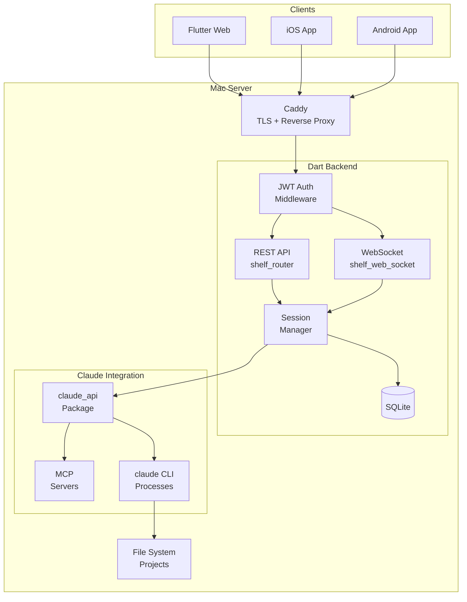
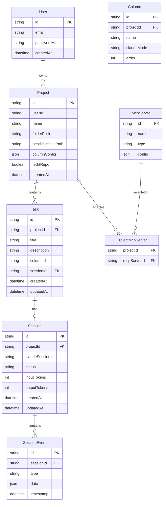
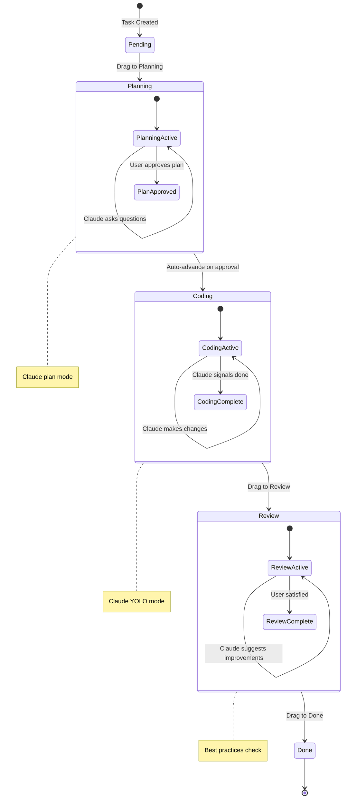

# Requirements & Research: Agent Board

## Goals

Build a **kanban-based agent orchestration platform** that blends a visual workflow metaphor with Claude Code automation. The system enables users to:

1. **Manage coding tasks visually** — Cards flow through columns (Pending → Planning → Coding → Review → Done), with each column triggering specific Claude Code behaviors.

2. **Automate phase transitions** — Dropping a card into a column auto-starts Claude work; approving a plan auto-advances the card to the next phase.

3. **Full Claude Code exposure** — Expose the complete `claude_api` functionality via a hardened, authenticated backend accessible from anywhere.

4. **Multi-user, multi-project** — Support multiple authenticated users, each with isolated projects (local folders), tasks, and session histories.

5. **Cross-platform access** — Flutter Web app (primary) plus native iOS/Android apps, all connecting to the same backend.

---

## User Scenarios

### Scenario 1: New Task Creation
**Actor:** Developer
**Flow:**
1. User selects a project (linked to a local folder path)
2. User creates a new task card with title and description
3. Card appears in **Pending** column
4. User drags card to **Planning** column to begin

### Scenario 2: Planning Phase
**Actor:** Developer
**Flow:**
1. Card dropped into **Planning** column triggers Claude Code in **plan mode**
2. Chat panel activates showing the Claude session for this task
3. Claude explores codebase, asks clarifying questions, produces a plan
4. User reviews plan in chat, provides feedback or approves
5. On approval, card **auto-advances** to **Coding** column

### Scenario 3: Coding Phase
**Actor:** Developer
**Flow:**
1. Card in **Coding** column triggers Claude Code in **YOLO mode** (auto-accept edits)
2. Claude implements the approved plan, making file changes
3. User monitors progress in chat, can intervene if needed
4. When Claude signals completion, user reviews changes
5. User drags card to **Review** column

### Scenario 4: Review Phase
**Actor:** Developer
**Flow:**
1. Card in **Review** column triggers Claude Code with project's **best-practices.md**
2. Claude reviews the implementation against specified standards
3. Claude suggests improvements, user accepts/rejects
4. User drags card to **Done** when satisfied

### Scenario 5: Session History & Resumption
**Actor:** Developer
**Flow:**
1. User views historical sessions for a project or task
2. User selects a past session to review conversation
3. User can **duplicate** or **continue** the session for follow-up work
4. All history retained indefinitely

### Scenario 6: Project Configuration
**Actor:** Developer
**Flow:**
1. User creates/edits project pointing to local folder path
2. System detects git repository if present (enables branch awareness)
3. User configures:
   - Column definitions (or uses defaults)
   - Best practices markdown file path
   - MCP servers to enable (selected from global pool)
4. Configuration persists in SQLite

### Scenario 7: Multi-Device Access
**Actor:** Developer
**Flow:**
1. User authenticates with JWT token
2. Accesses Agent Board from laptop browser, phone app, or tablet
3. All see the same projects, tasks, and active sessions
4. Real-time updates via WebSocket

### Scenario 8: Interactive Q&A (AskUserQuestion)
**Actor:** Developer
**Flow:**
1. During any phase, Claude may need clarification from the user
2. Claude invokes `AskUserQuestion` tool with structured options
3. Chat UI displays **interactive chip/tab selector** (matching Claude Code's native UX)
4. User sees question header, description, and 2-4 selectable options
5. User taps/clicks an option (or selects "Other" for custom input)
6. Answer is sent back to Claude, which continues processing
7. Full Q&A history preserved in session

**Example UX:**
```
┌─────────────────────────────────────────────────┐
│  Auth Method                                    │
│                                                 │
│  Which authentication approach should we use?  │
│                                                 │
│  ┌─────────────────┐  ┌─────────────────┐      │
│  │ JWT Tokens      │  │ OAuth2          │      │
│  │ (Recommended)   │  │                 │      │
│  │ Stateless,      │  │ Integrate with  │      │
│  │ supports        │  │ Google/GitHub   │      │
│  │ refresh         │  │                 │      │
│  └─────────────────┘  └─────────────────┘      │
│                                                 │
│  ┌─────────────────┐  ┌─────────────────┐      │
│  │ API Keys        │  │ Other...        │      │
│  │ Simple static   │  │ Custom input    │      │
│  │ keys            │  │                 │      │
│  └─────────────────┘  └─────────────────┘      │
└─────────────────────────────────────────────────┘
```

---

## Features

### Backend Features

| Feature | Description | Priority |
|---------|-------------|----------|
| **JWT Authentication** | Stateless bearer tokens via `dart_jsonwebtoken`. Login returns access + refresh tokens. | P0 |
| **User Management** | Create accounts, change passwords, manage sessions. Multi-user with full isolation. | P0 |
| **Project Management** | CRUD for projects. Each project = folder path + name + config. Git detection. | P0 |
| **Task Management** | CRUD for tasks. Each task = title + description + column + linked session. | P0 |
| **Session Management** | Create, resume, duplicate, delete sessions. Streaming via WebSocket. | P0 |
| **Interactive Tool Responses** | Intercept `AskUserQuestion` tool calls, relay to frontend, inject user responses. | P0 |
| **Column Configuration** | Default columns (Pending/Planning/Coding/Review/Done) + per-project customization. | P1 |
| **MCP Server Registry** | Global MCP server definitions. Per-project selection of which servers to enable. | P1 |
| **Best Practices Files** | Per-project markdown file path for Review phase prompting. | P1 |
| **Rate Limiting** | Protect backend from abuse. Per-user limits. | P1 |
| **SQLite Persistence** | All data persisted. Sessions/history retained forever. | P0 |

### Frontend Features

| Feature | Description | Priority |
|---------|-------------|----------|
| **Kanban Board** | `appflowy_board` with drag-and-drop columns. Cards show title + status. | P0 |
| **Chat Panel** | `flutter_ai_toolkit` with custom provider wrapping `claude_api`. Shows active session. | P0 |
| **Interactive Q&A Widget** | Chip/tab selector UI for `AskUserQuestion`. Supports single/multi-select + custom input. | P0 |
| **Project Selector** | Dropdown/drawer to switch between projects. | P0 |
| **Task Detail View** | View/edit task title, description, current column, linked session. | P0 |
| **Session History** | List of past sessions. View, duplicate, or continue. | P1 |
| **Column Config UI** | Configure column names and Claude behaviors per project. | P1 |
| **MCP Server Config UI** | View global servers, toggle per-project enablement. | P2 |
| **User Settings** | Profile, password change, token management. | P1 |

### Cross-Cutting Features

| Feature | Description | Priority |
|---------|-------------|----------|
| **Real-Time Streaming** | WebSocket for session events. Immediate UI updates. | P0 |
| **Offline Graceful Degradation** | Show cached data when offline. Queue actions for reconnect. | P2 |
| **Responsive Design** | Works on phone, tablet, desktop browser. | P0 |

---

## Known UX / Technical / QA Considerations

### UX Considerations

1. **Auto-Start Feedback** — When a card is dropped and work auto-starts, provide clear visual feedback (spinner, status badge) so user knows Claude is working.

2. **Plan Approval Flow** — In-chat approval must be unambiguous. Consider a distinct "Approve Plan" button in the chat UI rather than relying on text parsing.

3. **Session Context Switching** — When user selects a different task, the chat panel must smoothly switch to that task's session without losing scroll position in the board.

4. **Long-Running Sessions** — Claude work can take minutes. Show progress indicators, allow user to navigate away and return.

5. **Error Recovery** — If Claude errors mid-task, card should NOT auto-advance. Show error state, allow retry or manual intervention.

### Technical Considerations

1. **Process Per Session** — The `claude_api` spawns a new `claude` CLI process per message. For concurrent tasks, this means multiple processes. Monitor resource usage.

2. **Session ID Management** — `claude_api` uses session IDs for resumption. The backend must map Task → Session → claude_api session ID correctly.

3. **WebSocket Scaling** — Each active session needs a WebSocket. With multiple users and tasks, connection count grows. Consider connection pooling or limits.

4. **File System Access** — Backend runs on local Mac, so file paths in projects are local. For remote access, paths are still local to the Mac running the backend.

5. **Git Operations** — If git-aware, need to handle repos with large histories, submodules, or unusual configs gracefully.

6. **MCP Server Lifecycle** — MCP servers (from `claude_api`) use auto-allocated ports. Must ensure proper cleanup on session end.

7. **JWT Refresh** — Implement token refresh flow. Access tokens should be short-lived (15-60 min), refresh tokens longer (days/weeks).

8. **SQLite Concurrency** — SQLite handles concurrent reads well but single-writer. For multi-user, use WAL mode and handle busy states.

9. **AskUserQuestion Interception** — The `claude_api` package currently closes stdin immediately after sending a message (fire-and-forget model). To support interactive tool responses, we need bidirectional communication. See "AskUserQuestion Integration" in Tech Notes for details.

### QA Considerations

1. **Integration Tests** — Test full flow: create task → drag to Planning → Claude responds → approve → auto-advance → Coding → etc.

2. **Session Resumption** — Verify sessions resume correctly after backend restart, after client disconnect, after app backgrounding.

3. **Concurrent Sessions** — Test multiple active sessions simultaneously (different tasks, same user).

4. **Authentication Edge Cases** — Expired tokens, invalid tokens, token refresh race conditions.

5. **WebSocket Reconnection** — Test client reconnect after network drop, server restart.

6. **Error Scenarios** — Claude process crash, MCP server failure, disk full, invalid project path.

---

## Tech Notes from Research

### claude_api Package (from /Users/csells/code/Norbert515/vide_cli/packages/claude_api)

**Architecture:**
- `ClaudeClient` is the main entry point, created with `ClaudeClient.create(config, mcpServers)`
- Spawns `claude` CLI process per message with `--output-format=stream-json`
- Session continuity via `--session-id` (first message) and `--resume` (subsequent)
- Streams JSONL responses parsed into typed `ClaudeResponse` subclasses

**Key Classes:**
- `ClaudeClient` — Send messages, get conversation stream, abort, access MCP servers
- `ClaudeConfig` — Model, timeout, temperature, system prompt, working directory, permission mode
- `Conversation` — Messages, state, token counts
- `ConversationMessage` — Role, content, tool invocations, streaming state
- `McpServerBase` — Abstract base for MCP servers with auto port allocation

**Response Types:**
- `TextResponse` — Streaming text (partial/complete)
- `ToolUseResponse` — Tool invocation with parameters
- `ToolResultResponse` — Tool output
- `CompletionResponse` — Turn complete with token usage
- `ErrorResponse` — Error with details

**Session Persistence:**
- Claude Code stores history in `~/.claude/projects/{encoded-path}/{sessionId}.jsonl`
- `ConversationLoader` reads history, merges tool results, decodes HTML entities

**Key Insight:** The package is process-per-message, not connection-based. Each `sendMessage()` spawns a new CLI process. Session state maintained by Claude Code's own persistence, not in-memory.

### AskUserQuestion Integration (CRITICAL FEATURE)

**How AskUserQuestion Works in Claude Code CLI:**

When Claude needs user input, it invokes the `AskUserQuestion` tool. In the CLI:
1. Claude emits a `tool_use` event with `name: "AskUserQuestion"`
2. The CLI's native terminal UI displays the chip/tab selector
3. User selects an option
4. CLI sends the answer as a `tool_result` back to Claude
5. Claude continues processing

**AskUserQuestion Tool Schema:**
```json
{
  "questions": [
    {
      "question": "Full question text (required)",
      "header": "Short label, max 12 chars (required)",
      "multiSelect": false,
      "options": [
        {
          "label": "1-5 word choice (required)",
          "description": "Explanation of this choice (required)"
        }
      ]
    }
  ]
}
```

**Constraints:**
- 1-4 questions per tool call
- 2-4 options per question
- Header max 12 characters
- "Other" option auto-added for custom input
- Multi-select mode available

**Response Format:**
```json
{
  "answers": {
    "question text": "selected option label or custom text"
  }
}
```

**The Gap in claude_api:**

The current `claude_api` package does NOT support AskUserQuestion interception because:
1. **Stdin closed immediately** — After sending the message JSON, stdin is closed (line 237 in `claude_client.dart`)
2. **No tool response injection** — No mechanism to send `tool_result` events back to the running process
3. **No tool interception callback** — `ToolUseResponse` events are logged but not surfaced for external handling

**Proposed Extension to claude_api:**

To support interactive tools, we need to extend `claude_api` with:

```
// Pseudocode for extended ClaudeClient API

class ClaudeClient {
  // Existing
  Stream<Conversation> get conversation;
  void sendMessage(Message message);

  // NEW: Stream of tool calls that require external handling
  Stream<InteractiveToolRequest> get interactiveToolRequests;

  // NEW: Send a response to an interactive tool
  void respondToTool(String toolUseId, Map<String, dynamic> response);
}

class InteractiveToolRequest {
  String toolUseId;          // For correlation
  String toolName;           // "AskUserQuestion", etc.
  Map<String, dynamic> input; // Tool parameters
}
```

**Implementation Approach Options:**

| Approach | Description | Pros | Cons |
|----------|-------------|------|------|
| **A. Long-Running Process** | Keep stdin open, send `tool_result` via stdin when user responds | Native protocol, no external dependencies | Requires significant refactor of process management |
| **B. Custom MCP Server** | Create an MCP server for user input. Claude calls it, server signals frontend via WebSocket | Works with current process model, clean separation | Bypasses native `AskUserQuestion`, different protocol |
| **C. CLI Hook System** | Use Claude Code's `pre-tool-use` hooks to intercept and redirect | Leverages existing CLI features | Hook reliability issues reported, complex setup |

**✅ DECIDED: Approach A (Long-Running Process)**

**Strategy:** Fork `claude_api` → Extend → Contribute PR back to Norbert

Rationale:
- Uses the native `AskUserQuestion` tool and streaming JSON protocol
- No custom tooling or MCP workarounds
- Full fidelity with Claude Code's intended behavior
- Single source of truth for tool handling
- Contributing upstream benefits the broader community

**Fork & PR Workflow:**
1. Fork `Norbert515/vide_cli` repository
2. Create feature branch `feature/interactive-tool-support`
3. Implement changes to `packages/claude_api`
4. Add tests for new functionality
5. Submit PR to upstream with clear description
6. Use fork as dependency until PR is merged

**Required Changes to claude_api:**

1. **Keep stdin open** during message processing
2. **Detect interactive tool calls** — When `ToolUseResponse.toolName == "AskUserQuestion"`, pause and emit to external stream
3. **Provide response injection** — Accept `tool_result` JSON and write to stdin
4. **Handle timeout/abort** — If user doesn't respond, allow session abort

**Streaming JSON Protocol for Tool Response:**

To respond to a tool call, send this to stdin:
```json
{"type": "tool_result", "tool_use_id": "toolu_xxx", "content": "{\"answers\": {...}}"}
```

The process will then continue with the next response.

### appflowy_board Package (v0.1.2)

**Core Model:**
- `AppFlowyBoardController` — Manages groups (columns) and items (cards)
- `AppFlowyGroupData` — A column with ID, name, and list of items
- `AppFlowyGroupItem` — Interface for card data

**Drag-Drop Callbacks:**
- `onMoveGroup` — Column reordered
- `onMoveGroupItem` — Card moved within column
- `onMoveGroupItemToGroup` — Card moved to different column (key for phase transitions)

**Customization:**
- `AppFlowyBoardHeaderBuilder` — Custom column headers
- `AppFlowyBoardFooterBuilder` — Custom column footers
- `AppFlowyBoardCardBuilder` — Custom card widgets

**Platform Support:** Android, iOS, Linux, macOS, Windows, Web

### flutter_ai_toolkit Package

**Core Concept:** `LlmProvider` abstract interface for chat backends

**Key Widget:** `LlmChatView` — Full chat UI with streaming, attachments, voice input

**Custom Provider Pattern:**
```
abstract class LlmProvider {
  Stream<String> sendMessageStream(String prompt, {List<Attachment>?});
  // ... other methods
}
```

**For Agent Board:** Create a custom `ClaudeApiProvider` that wraps `ClaudeClient`:
- Maps `sendMessageStream()` to `ClaudeClient.sendMessage()`
- Converts `Conversation.messages` stream to UI updates
- Handles streaming text responses

### Shelf / shelf_web_socket (v1.4.2 / v3.0.0)

**Core Pattern:**
```dart
final handler = Pipeline()
    .addMiddleware(logRequests())
    .addMiddleware(authMiddleware())  // Custom JWT middleware
    .addHandler(router);

await shelf_io.serve(handler, 'localhost', 8080);
```

**WebSocket Handler:**
```dart
Router()..get('/ws/sessions/<id>', webSocketHandler((webSocket) {
  // webSocket.stream.listen() for incoming
  // webSocket.sink.add() for outgoing
}));
```

**Security Notes:**
- Suppress error details in production responses
- Use HTTPS in production (Caddy handles TLS termination)

### JWT Authentication (dart_jsonwebtoken)

**Pattern:**
```dart
// Create token
final jwt = JWT({'userId': '...', 'exp': ...});
final token = jwt.sign(SecretKey('secret'));

// Verify token
try {
  final jwt = JWT.verify(token, SecretKey('secret'));
} on JWTExpiredError { ... }
```

**Middleware Approach:**
```dart
Middleware authMiddleware() => (handler) => (request) {
  final authHeader = request.headers['Authorization'];
  if (authHeader == null || !authHeader.startsWith('Bearer ')) {
    return Response.unauthorized('Missing token');
  }
  final token = authHeader.substring(7);
  // Verify and attach user to request context
  return handler(request.change(context: {'user': userId}));
};
```

---

## Assumptions & Open Questions

### Assumptions

1. **Local File Access** — Backend runs on the same machine where project folders exist. No remote file system access needed.

2. **Single Backend Instance** — One backend process on the Mac. No horizontal scaling or load balancing required.

3. **Claude Code Installed** — `claude` CLI is installed and authenticated on the Mac running the backend.

4. **Trusted Network** — While JWT secures the API, network traffic will be encrypted via Caddy TLS. No additional encryption layer needed.

5. **Column Behaviors Fixed** — While column names are configurable, the behaviors map to fixed modes:
   - Planning = Claude plan mode
   - Coding = Claude YOLO mode (auto-accept edits)
   - Review = Claude with best-practices prompt

### Open Questions

1. **MCP Server Definitions** — Where are global MCP servers defined? In a config file, in the UI, or both?

2. **Plan Approval Keywords** — What text/action in chat constitutes "plan approved"? Specific command? UI button?

3. **Concurrent Task Limit** — Should there be a limit on how many tasks can be actively running Claude sessions at once? (Resource management)

4. **Project Path Validation** — When user enters a folder path, should we validate it exists? Only on the Mac running the backend.

5. **User Registration** — Open registration, or admin-created accounts only?

6. **Backup Strategy** — SQLite database backup approach? Manual, scheduled, or real-time replication?

7. **AskUserQuestion Implementation** — ✅ **DECIDED: Approach A** — Fork `claude_api`, extend with long-running process mode for interactive tool support, and contribute PR back to Norbert.

---

## Appendix A — Research Notes

### claude_api Package
- **Source:** `/Users/csells/code/Norbert515/vide_cli/packages/claude_api`
- **Key Files:**
  - `lib/src/client/claude_client.dart` — Main client implementation
  - `lib/src/client/process_manager.dart` — CLI process spawning
  - `lib/src/models/conversation.dart` — Conversation state model
  - `lib/src/mcp/server/mcp_server_base.dart` — MCP server abstraction
- **Protocol:** Uses `--output-format=stream-json` for JSONL streaming
- **Session Continuity:** `--session-id` for new, `--resume` for continuing

### appflowy_board
- **Pub.dev:** https://pub.dev/packages/appflowy_board
- **Version:** 0.1.2 (20 months old, stable)
- **License:** MPL-2.0, AGPL-3.0
- **Key Callback:** `onMoveGroupItemToGroup(groupId, fromIndex, toGroupId, toIndex)` — triggers phase transitions

### flutter_ai_toolkit
- **Pub.dev:** https://pub.dev/packages/flutter_ai_toolkit
- **Features:** Streaming responses, multi-turn context, voice input, attachments
- **Custom Provider:** Implement `LlmProvider` interface to wrap `claude_api`
- **Note:** Firebase initialization required for built-in providers, but custom providers bypass this

### Shelf
- **Pub.dev:** https://pub.dev/packages/shelf (v1.4.2)
- **WebSocket:** https://pub.dev/packages/shelf_web_socket (v3.0.0)
- **Docs:** https://pub.dev/documentation/shelf/latest/shelf/shelf-library.html

### JWT Authentication
- **Package:** https://pub.dev/packages/dart_jsonwebtoken
- **RFC:** RFC 7519 (JSON Web Tokens)
- **Tutorial:** https://itnext.io/authentication-with-jwt-in-dart-6fbc70130806

### SQLite for Dart
- **Package:** https://pub.dev/packages/sqlite3
- **Alternative:** https://pub.dev/packages/drift (ORM layer)
- **WAL Mode:** Recommended for concurrent access

### Caddy (TLS Termination)
- **Docs:** https://caddyserver.com/docs/
- **Auto HTTPS:** Automatic certificate provisioning via Let's Encrypt
- **Reverse Proxy:** Use `reverse_proxy localhost:8080` to proxy to Shelf backend

### AskUserQuestion Tool
- **Added in:** Claude Code v2.0.21
- **GitHub Issues:**
  - [DOCS] Missing Documentation: https://github.com/anthropics/claude-code/issues/10346
  - UI auto-completes without showing: https://github.com/anthropics/claude-code/issues/12672
  - PreToolUse hook interference: https://github.com/anthropics/claude-code/issues/13439
  - Empty results bug: https://github.com/anthropics/claude-code/issues/10229
- **Tool Schema Source:** https://github.com/Piebald-AI/claude-code-system-prompts/blob/main/system-prompts/tool-description-askuserquestion.md
- **Tutorial:** https://egghead.io/create-interactive-ai-tools-with-claude-codes-ask-user-question~b47wn
- **Stream Chaining Reference:** https://github.com/ruvnet/claude-flow/wiki/Stream-Chaining
- **Key Finding:** The CLI handles AskUserQuestion UI internally. For external handling, must keep process stdin open and inject `tool_result` responses.

---

## Architecture Diagram



## Data Model Diagram



## Task State Flow


