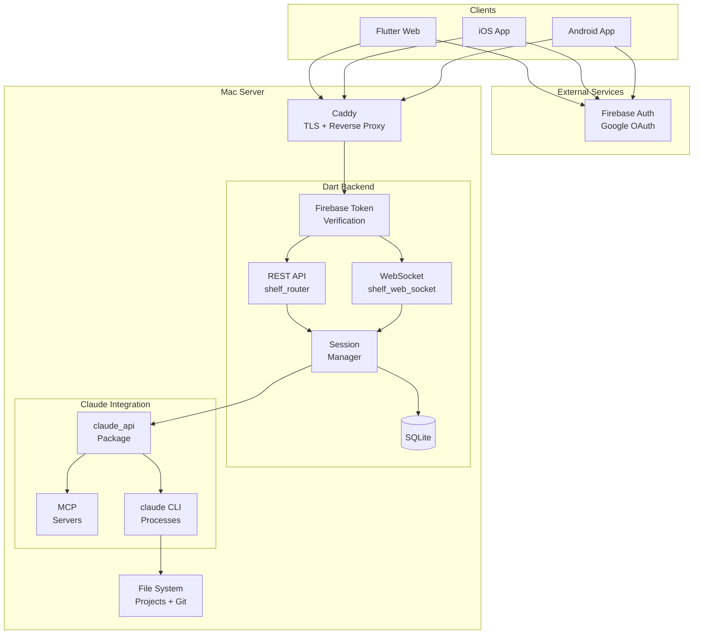
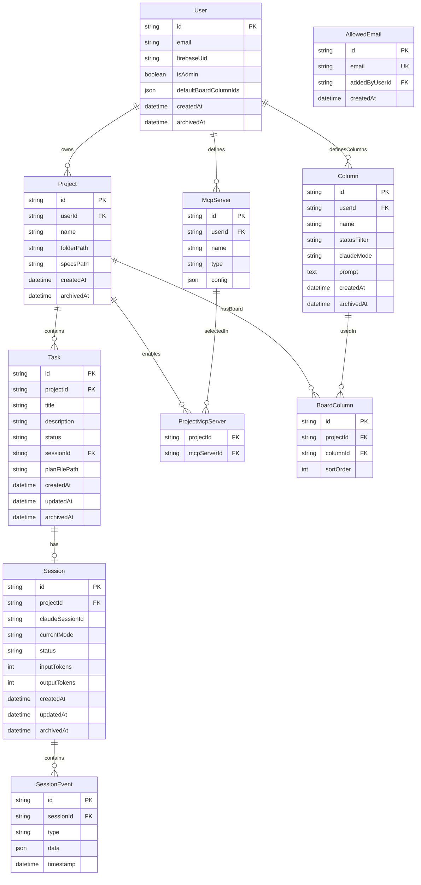
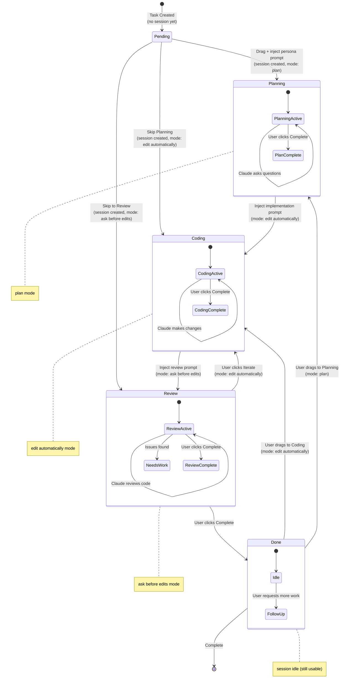

# Agent Board — Technical Design

This document contains technical design decisions, architecture diagrams, data
models, and research notes for implementing Agent Board. For requirements and
user journeys, see [requirements-and-research.md](requirements-and-research.md).

---

## Tech Notes from Research

### claude_api Package (from /Users/csells/code/Norbert515/vide_cli/packages/claude_api)

**Architecture:**
- `ClaudeClient` is the main entry point, created with
  `ClaudeClient.create(config, mcpServers)`
- Spawns `claude` CLI process per message with `--output-format=stream-json`
- Session continuity via `--session-id` (first message) and `--resume`
  (subsequent)
- Streams JSONL responses parsed into typed `ClaudeResponse` subclasses

**Key Classes:**
- `ClaudeClient` — Send messages, get conversation stream, abort, access MCP
  servers
- `ClaudeConfig` — Model, timeout, temperature, system prompt, working
  directory, permission mode
- `Conversation` — Messages, state, token counts
- `ConversationMessage` — Role, content, tool invocations, streaming state
- `McpServerBase` — Abstract base for MCP servers with auto port allocation

**Response Types:**
- `TextResponse` — Streaming text (partial/complete)
- `ToolUseResponse` — Tool invocation with parameters
- `ToolResultResponse` — Tool output
- `CompletionResponse` — Turn complete with token usage
- `ErrorResponse` — Error with details

**Session Persistence:**
- Claude Code stores history in
  `~/.claude/projects/{encoded-path}/{sessionId}.jsonl`
- `ConversationLoader` reads history, merges tool results, decodes HTML entities

**Key Insight:** The package is process-per-message, not connection-based. Each
`sendMessage()` spawns a new CLI process. Session state maintained by Claude
Code's own persistence, not in-memory.

### AskUserQuestion Integration (CRITICAL FEATURE)

**How AskUserQuestion Works in Claude Code CLI:**

When Claude needs user input, it invokes the `AskUserQuestion` tool. In the CLI:
1. Claude emits a `tool_use` event with `name: "AskUserQuestion"`
2. The CLI's native terminal UI displays the chip/tab selector
3. User selects an option
4. CLI sends the answer as a `tool_result` back to Claude
5. Claude continues processing

**AskUserQuestion Tool Schema:**
```json
{
  "questions": [
    {
      "question": "Full question text (required)",
      "header": "Short label, max 12 chars (required)",
      "multiSelect": false,
      "options": [
        {
          "label": "1-5 word choice (required)",
          "description": "Explanation of this choice (required)"
        }
      ]
    }
  ]
}
```

**Constraints:**
- 1-4 questions per tool call
- 2-4 options per question
- Header max 12 characters
- "Other" option auto-added for custom input
- Multi-select mode available

**Response Format:**
```json
{
  "answers": {
    "question text": "selected option label or custom text"
  }
}
```

**The Gap in claude_api:**

The current `claude_api` package does NOT support AskUserQuestion interception
because:
1. **Stdin closed immediately** — After sending the message JSON, stdin is
   closed (line 237 in `claude_client.dart`)
2. **No tool response injection** — No mechanism to send `tool_result` events
   back to the running process
3. **No tool interception callback** — `ToolUseResponse` events are logged but
   not surfaced for external handling

**Proposed Extension to claude_api:**

To support interactive tools, we need to extend `claude_api` with:

```
// Pseudocode for extended ClaudeClient API

class ClaudeClient {
  // Existing
  Stream<Conversation> get conversation;
  void sendMessage(Message message);

  // NEW: Stream of tool calls that require external handling
  Stream<InteractiveToolRequest> get interactiveToolRequests;

  // NEW: Send a response to an interactive tool
  void respondToTool(String toolUseId, Map<String, dynamic> response);
}

class InteractiveToolRequest {
  String toolUseId;          // For correlation
  String toolName;           // "AskUserQuestion", etc.
  Map<String, dynamic> input; // Tool parameters
}
```

**Implementation Approach Options:**

| Approach                    | Description                                                                                 | Pros                                               | Cons                                                  |
| --------------------------- | ------------------------------------------------------------------------------------------- | -------------------------------------------------- | ----------------------------------------------------- |
| **A. Long-Running Process** | Keep stdin open, send `tool_result` via stdin when user responds                            | Native protocol, no external dependencies          | Requires significant refactor of process management   |
| **B. Custom MCP Server**    | Create an MCP server for user input. Claude calls it, server signals frontend via WebSocket | Works with current process model, clean separation | Bypasses native `AskUserQuestion`, different protocol |
| **C. CLI Hook System**      | Use Claude Code's `pre-tool-use` hooks to intercept and redirect                            | Leverages existing CLI features                    | Hook reliability issues reported, complex setup       |

**DECIDED: Approach A (Long-Running Process)**

**Strategy:** Fork `claude_api` → Extend → Contribute PR back to Norbert

Rationale:
- Uses the native `AskUserQuestion` tool and streaming JSON protocol
- No custom tooling or MCP workarounds
- Full fidelity with Claude Code's intended behavior
- Single source of truth for tool handling
- Contributing upstream benefits the broader community

**Fork & PR Workflow:**
1. Fork `Norbert515/vide_cli` repository
2. Create feature branch `feature/interactive-tool-support`
3. Implement changes to `packages/claude_api`
4. Add tests for new functionality
5. Submit PR to upstream with clear description
6. Use fork as dependency until PR is merged

**Required Changes to claude_api:**

1. **Keep stdin open** during message processing
2. **Detect interactive tool calls** — When `ToolUseResponse.toolName ==
   "AskUserQuestion"`, pause and emit to external stream
3. **Provide response injection** — Accept `tool_result` JSON and write to stdin
4. **Handle timeout/abort** — If user doesn't respond, allow session abort

**Streaming JSON Protocol for Tool Response:**

To respond to a tool call, send this to stdin:
```json
{"type": "tool_result", "tool_use_id": "toolu_xxx", "content": "{\"answers\": {...}}"}
```

The process will then continue with the next response.

### appflowy_board Package (v0.1.2)

**Core Model:**
- `AppFlowyBoardController` — Manages groups (columns) and items (cards)
- `AppFlowyGroupData` — A column with ID, name, and list of items
- `AppFlowyGroupItem` — Interface for card data

**Drag-Drop Callbacks:**
- `onMoveGroup` — Column reordered
- `onMoveGroupItem` — Card moved within column
- `onMoveGroupItemToGroup` — Card moved to different column (key for phase
  transitions)

**Customization:**
- `AppFlowyBoardHeaderBuilder` — Custom column headers
- `AppFlowyBoardFooterBuilder` — Custom column footers
- `AppFlowyBoardCardBuilder` — Custom card widgets

**Platform Support:** Android, iOS, Linux, macOS, Windows, Web

### flutter_ai_toolkit Package

**Core Concept:** `LlmProvider` abstract interface for chat backends

**Key Widget:** `LlmChatView` — Full chat UI with streaming, attachments, voice
input

**Custom Provider Pattern:**
```
abstract class LlmProvider {
  Stream<String> sendMessageStream(String prompt, {List<Attachment>?});
  // ... other methods
}
```

**For Agent Board:** Create a custom `ClaudeApiProvider` that wraps
`ClaudeClient`:
- Maps `sendMessageStream()` to `ClaudeClient.sendMessage()`
- Converts `Conversation.messages` stream to UI updates
- Handles streaming text responses
- Supports @ file references with autocomplete
- Supports slash commands via input processing

### go_router Package

**Pub.dev:** https://pub.dev/packages/go_router

**Purpose:** Declarative routing for Flutter with deep linking support.

**Key Features for Agent Board:**
- Tab-based navigation (Kanban Board, Chat)
- URL-based routing for deep linking to projects/tasks
- Nested navigation within tabs
- State preservation across tab switches

**Usage Pattern:**
```dart
final router = GoRouter(
  routes: [
    ShellRoute(
      builder: (context, state, child) => AppShell(child: child),
      routes: [
        GoRoute(path: '/board', builder: (_, __) => KanbanBoardTab()),
        GoRoute(path: '/chat', builder: (_, __) => ChatTab()),
      ],
    ),
  ],
);
```

### Riverpod v3 Package

**Pub.dev:** https://pub.dev/packages/flutter_riverpod

**Version:** 3.x (latest)

**Purpose:** State management with compile-time safety and code generation.

**Key Patterns for Agent Board:**
- `@riverpod` annotation for code generation
- `AsyncNotifier` for async state (projects, tasks, sessions)
- `StreamProvider` for WebSocket updates (file cache, session events)
- Scoped providers for per-project/per-task state

**State Architecture:**
```dart
// User-global state
@riverpod
class AuthState extends _$AuthState { ... }

@riverpod
class ColumnLibrary extends _$ColumnLibrary { ... }

// Per-project state
@riverpod
class ProjectTasks extends _$ProjectTasks {
  @override
  Future<List<Task>> build(String projectId) async { ... }
}

// Real-time updates
@riverpod
Stream<FileCache> fileCache(FileCacheRef ref, String projectId) { ... }
```

**Benefits over other solutions:**
- Code generation eliminates boilerplate
- Compile-time provider dependency checking
- Auto-dispose when providers are no longer used
- Easy testing with provider overrides

### Shelf / shelf_web_socket (v1.4.2 / v3.0.0)

**Core Pattern:**
```dart
final handler = Pipeline()
    .addMiddleware(logRequests())
    .addMiddleware(authMiddleware())  // Custom JWT middleware
    .addHandler(router);

await shelf_io.serve(handler, 'localhost', 8080);
```

**WebSocket Handler:**
```dart
Router()..get('/ws/sessions/<id>', webSocketHandler((webSocket) {
  // webSocket.stream.listen() for incoming
  // webSocket.sink.add() for outgoing
}));
```

**Security Notes:**
- Suppress error details in production responses
- Use HTTPS in production (Caddy handles TLS termination)

### Firebase Authentication

**Frontend (Flutter):**
```dart
// Google Sign-In via Firebase
final googleUser = await GoogleSignIn().signIn();
final googleAuth = await googleUser.authentication;
final credential = GoogleAuthProvider.credential(
  accessToken: googleAuth.accessToken,
  idToken: googleAuth.idToken,
);
final userCredential = await FirebaseAuth.instance.signInWithCredential(credential);
final idToken = await userCredential.user.getIdToken();
// Send idToken to backend with each request
```

**Backend (Dart):**
```dart
// Verify Firebase ID token
// Option 1: Use Firebase Admin SDK (Node.js sidecar)
// Option 2: Verify JWT manually with Firebase public keys

Middleware firebaseAuthMiddleware() => (handler) => (request) async {
  final authHeader = request.headers['Authorization'];
  if (authHeader == null || !authHeader.startsWith('Bearer ')) {
    return Response.unauthorized('Missing token');
  }
  final idToken = authHeader.substring(7);

  // Verify token and extract email
  final decodedToken = await verifyFirebaseToken(idToken);
  final email = decodedToken['email'];

  // Check allowlist (skip for admin)
  if (email != adminEmail && !await isEmailAllowed(email)) {
    return Response.forbidden('Email not in allowlist');
  }

  return handler(request.change(context: {'email': email, 'isAdmin': email == adminEmail}));
};
```

**Packages:**
- Flutter: `firebase_auth`, `google_sign_in`
- Backend: `dart_jsonwebtoken` (for manual JWT verification with Firebase public
  keys)

**Admin Configuration:**
```bash
# .env file
ADMIN_EMAIL=admin@example.com
```

---

## Research Notes

### claude_api Package
- **Source:** `/Users/csells/code/Norbert515/vide_cli/packages/claude_api`
- **Key Files:**
  - `lib/src/client/claude_client.dart` — Main client implementation
  - `lib/src/client/process_manager.dart` — CLI process spawning
  - `lib/src/models/conversation.dart` — Conversation state model
  - `lib/src/mcp/server/mcp_server_base.dart` — MCP server abstraction
- **Protocol:** Uses `--output-format=stream-json` for JSONL streaming
- **Session Continuity:** `--session-id` for new, `--resume` for continuing

### appflowy_board
- **Pub.dev:** https://pub.dev/packages/appflowy_board
- **Version:** 0.1.2 (20 months old, stable)
- **License:** MPL-2.0, AGPL-3.0
- **Key Callback:** `onMoveGroupItemToGroup(groupId, fromIndex, toGroupId,
  toIndex)` — triggers phase transitions

### flutter_ai_toolkit
- **Pub.dev:** https://pub.dev/packages/flutter_ai_toolkit
- **Features:** Streaming responses, multi-turn context, voice input,
  attachments
- **Custom Provider:** Implement `LlmProvider` interface to wrap `claude_api`
- **Note:** Firebase initialization required for built-in providers, but custom
  providers bypass this

### Shelf
- **Pub.dev:** https://pub.dev/packages/shelf (v1.4.2)
- **WebSocket:** https://pub.dev/packages/shelf_web_socket (v3.0.0)
- **Docs:** https://pub.dev/documentation/shelf/latest/shelf/shelf-library.html

### Firebase Authentication
- **Flutter Package:** https://pub.dev/packages/firebase_auth
- **Google Sign-In:** https://pub.dev/packages/google_sign_in
- **Firebase Console:** https://console.firebase.google.com/
- **Token Verification:** Firebase ID tokens are JWTs signed by Google; verify
  using Firebase public keys
- **Public Keys URL:**
  https://www.googleapis.com/robot/v1/metadata/x509/securetoken@system.gserviceaccount.com

### SQLite for Dart
- **Package:** https://pub.dev/packages/sqlite3
- **Alternative:** https://pub.dev/packages/drift (ORM layer)
- **WAL Mode:** Recommended for concurrent access

### Caddy (TLS Termination)
- **Docs:** https://caddyserver.com/docs/
- **Auto HTTPS:** Automatic certificate provisioning via Let's Encrypt
- **Reverse Proxy:** Use `reverse_proxy localhost:8080` to proxy to Shelf
  backend

### AskUserQuestion Tool
- **Added in:** Claude Code v2.0.21
- **GitHub Issues:**
  - [DOCS] Missing Documentation:
    https://github.com/anthropics/claude-code/issues/10346
  - UI auto-completes without showing:
    https://github.com/anthropics/claude-code/issues/12672
  - PreToolUse hook interference:
    https://github.com/anthropics/claude-code/issues/13439
  - Empty results bug: https://github.com/anthropics/claude-code/issues/10229
- **Tool Schema Source:**
  https://github.com/Piebald-AI/claude-code-system-prompts/blob/main/system-prompts/tool-description-askuserquestion.md
- **Tutorial:**
  https://egghead.io/create-interactive-ai-tools-with-claude-codes-ask-user-question~b47wn
- **Stream Chaining Reference:**
  https://github.com/ruvnet/claude-flow/wiki/Stream-Chaining
- **Key Finding:** The CLI handles AskUserQuestion UI internally. For external
  handling, must keep process stdin open and inject `tool_result` responses.

---

## Architecture Diagram



---

## Data Model Diagram



**Key Data Model Notes:**
- `User ||--o{ Column` — Columns are **user-global**, not per-project. Users
  define columns once and reuse them across projects.
- `Project ||--o{ BoardColumn` — Projects have a **board** composed of columns
  from the user's column library. BoardColumn defines which columns appear and
  their order.
- `User.defaultBoardColumnIds` — JSON array of column IDs for new project
  defaults.
- `Task.status` — Status determines which column(s) the task appears in. Values:
  `pending`, `planning`, `coding`, `review`, `done`. Dragging a task to a column
  updates the task's status to match the column's statusFilter.
- `Column.statusFilter` — Filters which tasks appear in the column. Must match a
  valid Task status. A column with statusFilter="planning" shows tasks with
  status="planning". Special `*` filter shows all unarchived tasks regardless
  of status (dragging to a `*` column leaves task status unchanged).
- `Task.planFilePath` — Path to the plan file generated during Planning phase
  (e.g., `specs/add-wishlist-feature-plan.md`).
- `Project.specsPath` — Configurable path for plan files (default: `specs/`).
- `Task ||--o| Session` — Zero-or-one (lazy creation); once created, session
  is continuous.
- `Session.currentMode` — Tracks current Claude mode (plan, ask before edits, edit automatically, bypass permissions).
- `Session` uses **auto-compact** to manage context length.
- `archivedAt` — Soft delete pattern; null = active, timestamp = archived.
- `AllowedEmail` — Admin-managed allowlist for user registration.
- `User.firebaseUid` — Firebase Authentication user ID.
- `User.isAdmin` — Derived from `ADMIN_EMAIL` env var match, stored for query
  convenience.
- **New user seeding** — When a user is created, seed five default Column records:
  Pending, Planning, Coding, Review, Done. Set `defaultBoardColumnIds` to these
  column IDs. This gives every user a starting column library.

---

## Task State Flow



**Key Flow Clarifications:**
- **Lazy session creation** — `claude_api` session created on first message or
  column move
- **ONE continuous session** per Task (with auto-compact) — never restarted
- Column transitions **inject prompts** into the same session (like user typed
  them)
- Column transitions **change Claude mode** (plan → edit automatically → ask before edits)
- **Users can skip columns** — e.g., Pending → Coding directly
- Full conversation context preserved throughout task lifecycle
- Review can **loop back** to Coding via Iterate button
- **Done column uses drag-and-drop** — No action buttons in Done; user drags card
  to Planning or Coding to choose destination (provides flexibility vs single Iterate target)
- **Button visibility rules** — Complete button visible when there's a column to the right;
  Iterate button visible when there's a column to the left (except in Done)
